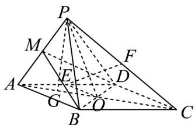

> [!faq]- 《专题8.4 空间点、直线、平面之间的位置关系（高效培优讲义）》官方解析
>
> > [!success]- **【答案】** (1)证明见解析 (2) $\frac{5}{13}$ (3) $\frac{2\sqrt{273}}{91}$
>
> > [!note]- **【分析】**
> > （1）要证明线线垂直，可通过证明线面垂直推导出线线垂直，即证明 $BD \perp$ 平面PAC，
> >
> > (2) 首先确定 $\triangle PAB, \triangle PAD$ 是等腰三角形，然后作辅助线，找出二面角 B-PA-D 的平面角，然后根据线段
> >
> > 的长度和余弦定理求出其余弦值·
> >
> > (3) 根据体积关系 $V_{F-PAB} = \frac{1}{2} V_{P-ABC}$ 先求出点 F 到平面 PAB 的距离，然后即可求出直线 AF 与该平面所成角
> >
> > 的正弦值·
>
> > [!note]- **【解析】**
> > （1）证明：连接 AC 交 BD 于点 O，再连接 PO，如图所示。
> >
> > 在 $\triangle PBD$ 中， $PB = PD$ ，O 是 BD 的中点，所以 $PO \perp BD$ ，
> >
> > 又四边形 ABCD 是边长为 $^{2}$ 的菱形，所以 $BD \perp AC$ ，
> >
> > 又 $AC \cap PO = O$ ，AC, $PO \subset$ 平面 PAC，所以 $BD \perp$ 平面 PAC，
> >
> > 又 $AF \subset$ 平面 PAC ，所以 $AF \perp BD \cdot$
> >
> > (2) 因为四边形 ABCD 是边长为 $^{2}$ 的菱形， $\angle BAD = 60^{\circ}$
> >
> > 所以可求得 $AO = AD\cos 30^{\circ} = \sqrt{3}$ ，所以 $AC = 2AO = 2\sqrt{3}$
> >
> > 因为 $PA = \sqrt{3}$ ， $PC = 3$ ， $AC = 2\sqrt{3}$
> >
> > 所以 $PA^2 + PC^2 = AC^2$ ，所以 $PA \perp PC$ ，且 $\angle PCA = 30^\circ$
> >
> > 所以 $PO = \frac{1}{2} AC = \sqrt{3}$ ，又 $PO \perp BD$ ，所以 $PB = PD = \sqrt{PO^{2} + OB^{2}} = 2$ 。
> >
> > 取 $PA$ 的中点 $M$ ，连接 $MB$ ， $MD$ ，如图所示.
> >
> > 在 $\triangle BAP$ 中， $BA = 2$ ， $BP = 2$ ， $AP = \sqrt{3}$ ，点 $M$ 是 $PA$ 的中点，
> >
> > 所以 $BM \perp PA$ ，且 $BM = \sqrt{AB^2 - \left(\frac{PA}{2}\right)^2} = \frac{\sqrt{13}}{2}$ 。
> >
> > 同理可得 $DM \perp PA$ ， $DM = \frac{\sqrt{13}}{2}$ ，所以二面角 $B - PA - D$ 的平面角为 $\angle BMD$ ，
> >
> > 在 $\triangle BMD$ 中， $DM = \frac{\sqrt{13}}{2}$ ， $BM = \frac{\sqrt{13}}{2}$ ， $BD = 2$
> >
> > 由余弦定理得 $\cos\angle BMD=\frac{MB^{2}+MD^{2}-BD^{2}}{2MB\cdot MD}=\frac{\frac{13}{4}+\frac{13}{4}-4}{2\times\frac{\sqrt{13}}{2}\times\frac{\sqrt{13}}{2}}=\frac{5}{13}$ ，即二面角 B-PA-D 的余弦值为 $\frac{5}{13}$
> >
> > (3) 由 (2) 知 $PA = PO = AO = \sqrt{3}$ ，取 $AO$ 的中点 $G$ ，连接 $PG$ .
> >
> > 在 $\triangle PCG$ 中， $PG \perp GC$ ，所以根据勾股定理得 $PG = \frac{3}{2}$
> >
> > 由（2）知 $\triangle PAB$ 的面积 $S_{\triangle PAB} = \frac{1}{2} PA\cdot BM = \frac{1}{2}\times \sqrt{3}\times \frac{\sqrt{13}}{2} = \frac{\sqrt{39}}{4}$
> >
> > 因为点 $F$ 是 $PC$ 的中点，所以 $V_{F - PAB} = \frac{1}{2} V_{C - PAB} = \frac{1}{2} V_{P - ABC} = \frac{1}{2}\times \frac{1}{3}\times \frac{1}{2}\times 2\times 2\sin 120^{\circ}\times \frac{3}{2} = \frac{\sqrt{3}}{4}$
> >
> > 设点 F 到平面 PAB 的距离为 d，所以 $V_{F-PAB} = \frac{1}{3} S_{\triangle PAB} \cdot d = \frac{1}{3} \times \frac{\sqrt{39}}{4} d = \frac{\sqrt{39}}{12} d = V_{F-PAB} = \frac{\sqrt{3}}{4}$
> >
> > 解得 $d = \frac{3\sqrt{13}}{13}$
> >
> > 又 $AF = \sqrt{PA^2 + PF^2} = \frac{\sqrt{21}}{2}$ ，设直线与平面所成角为 $\theta$ ，所以 $\sin \theta = \frac{d}{AF} = \frac{\frac{3\sqrt{13}}{13}}{\frac{\sqrt{21}}{2}} = \frac{2\sqrt{273}}{91}$
> >
> > 所以直线 $AF$ 与平面 $PAB$ 所成角的正弦值为 $\frac{2\sqrt{273}}{91}$
> >
> > 
