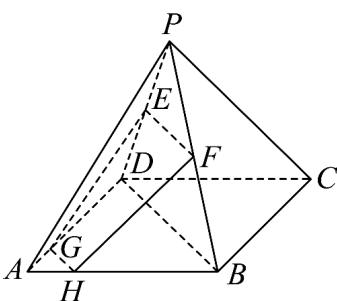

> [!faq]- 《专题8.4 空间点、直线、平面之间的位置关系（高效培优讲义）》官方解析
>
> > [!success]- **【答案】** (1)24 (2)证明见解析 (3)证明见解析
>
> > [!note]- **【分析】**
> > （1）根据正四棱锥的几何性质求解高 $h$ ，再利用锥体体积公式计算即可；
> >
> > (2) 由中位线性质可得 $EF \parallel BD$ ，由平行线分线段成比例得 $GH \parallel BD$ ，结合平行公里即可得结论；
> >
> > (3) 分析可得 $EG, FH$ 交于一点，记交点为 $M$ ，由平面的基本性质可得 $M \in PA$ ，即可得结论.
>
> > [!note]- **【解析】**
> > （1）因为 $AB = 3\sqrt{2}, PA = 5$
> >
> > 所以正四棱锥 $P-ABCD$ 的高 $h=\sqrt{PA^{2}-\left(\frac{AB}{\sqrt{2}}\right)^{2}}=\sqrt{5^{2}-\left(\frac{3\sqrt{2}}{\sqrt{2}}\right)^{2}}=4$
> >
> > 所以正四棱锥 P-ABCD 的体积 $V=\frac{1}{3}\times3\sqrt{2}\times3\sqrt{2}\times4=24$
> >
> > (2) 证明：连接 BD，
> >
> > 
> >
> > 因为点 E, F 分别为 PD, PB 的中点，
> >
> > 所以 $EF / / BD, EF = \frac{1}{2} BD$
> >
> > 又点 G, H 分别为棱 AD, AB 上的一点，且 DG = 3AG, BH = 3AH
> >
> > 所以 $GH / / BD, GH = \frac{1}{4} BD$
> >
> > 所以 $EF / / GH$ ，所以 $E,F,H,G$ 四点共面；
> >
> > (3) 证明：由 (2) 知 $EF // GH, EF \neq GH$
> >
> > 所以直线 EG, FH 相交，记交点为 M ，
> >
> > 所以 $M \in EG$ ，又 $EG \subset$ 平面 PAD，
> >
> > 所以 $M \in$ 平面 PAD ，
> >
> > 同理可得 $M \in$ 平面 $PAB$ ，
> >
> > 又平面 $PAB \cap$ 平面 PAD = PA ，
> >
> > 所以 $M \in PA$ ，即直线 EG, FH, PA 三条直线交于一点.
