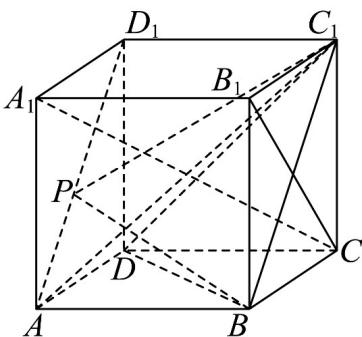
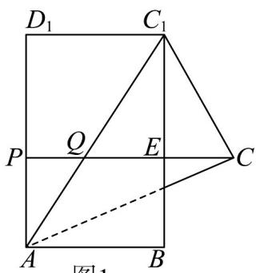
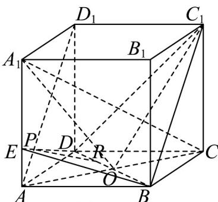

> [!faq]- 《专题8.4 空间点、直线、平面之间的位置关系（高效培优讲义）》官方解析
>
> > [!success]- **【答案】**  A. 异面直线 $PC_{1}$ 与直线 $B_{1}C$ 所成角的大小为 $\frac{\pi}{2}$ B．二面角 $P - BC_{1} - D$ 的大小为定值 C. 若 $Q$ 是对角线 $AC_{1}$ 上一点，则 $PQ + QC$ 的长度的最小值为 $\frac{5}{4}$ D．若 R 是线段 BD 上一动点，则直线 PR 可能与直线 $A_{1}C$ 平行
>
> > [!note]- **【分析】**
> > 对于 A：由正方体性质， $B_{1}C$ 垂直平面 $ABC_{1}D_{1}$ ， $PC_{1}$ 在平面 $ABC_{1}D_{1}$ 内，所以 $B_{1}C$ 垂直 $PC_{1}$ ，异面直
> >
> > 线所成角为 $\frac{\pi}{2}$
> >
> > 对于 B：平面 $PBC_{1}$ 即平面 $ABC_{1}D_{1}$ ，它与平面 $BC_{1}D$ 所成二面角是定值。
> >
> > 对于 C：将平面 $ACC_{1}$ 沿 $AC_{1}$ 翻折，过 C 作 $CP$ 垂直 $AD_{1}$ 确定 Q、E 点，通过角度计算等得出 $PQ + QC$ 最小值
> >
> > 不是所给值，所以错误·
> >
> > 对于 D：先证 $A_{1}C$ 垂直平面 $BDC_{1}$ ，确定二面角平面角，用余弦定理判断角度，再说明在 $AA_{1}$ 上存在点 E 使二
> >
> > 面角为 $\frac{\pi}{2}$
>
> > [!note]- **【解析】**
> > 对于 A，由正方体的性质可知， $B_{1}C \perp$ 平面 $ABC_{1}D_{1}$ ，又 $PC_{1} \subset$ 平面 $ABC_{1}D_{1}$ ，
> >
> > 所以 $B_{1}C \perp PC_{1}$ ，异面直线 $PC_{1}$ 与直线 $B_{1}C$ 所成的角为 $\frac{\pi}{2}$ ，A 正确.
> >
> > 对于 B，平面 $PBC_{1}$ 即为平面 $ABC_{1}D_{1}$ ，平面 $ABC_{1}D_{1}$ 与平面 $BC_{1}D$ 所成的二面角，其为定值，B 正确.
> >
> > 对于 C，将平面 $ACC_{1}$ 沿直线· $AC_{1}$ 翻折到平面 $ABC_{1}D_{1}$ 内，平面图如图 1，
> >
> > 过点 C 作 $CP \perp AD_{1}, CP \cap AC_{1} = Q, CP \cap BC_{1} = E$ ，此时， $PQ + QC$ 的值最小.
> >
> > 
> >
> > 由题可知， $CC_{1}=1,CA=\sqrt{2},AC_{1}=\sqrt{3},\angle D_{1}AC_{1}=\angle C_{1}AC=\angle AC_{1}B$
> >
> > $$
> > \sin \angle C _ {1} A C = \frac {\sqrt {3}}{3}, \cos \angle C _ {1} A C = \frac {\sqrt {6}}{3}
> > $$
> >
> > 则 $\angle CC_{1}E = \frac{\pi}{2} - 2\angle C_{1}AC, \sin \angle CC_{1}E = \cos 2\angle C_{1}AC = 2\cos^{2}\angle C_{1}AC - 1 = \frac{1}{3}$
> >
> > 故 $EC = CC_{1} \cdot \sin \angle CC_{1}E = \frac{1}{3}.$
> >
> > 又 $PE = AB = 1$ ，所以 $PQ + QC$ 的长度的最小值为 $\frac{4}{3}$ ，C错误.
> >
> > 对于 D，在正方体 $ABCD-A_{1}B_{1}C_{1}D_{1}$ 中，易证· $A_{1}C \perp$ 平面 $BDC_{1}$
> >
> > 设 $AC \cap BD = O$ 则 $\angle A_{1}OC_{1}$ 即为二面角 $A_{1} - BD - C_{1}$ 的平面角，
> >
> > 又正方体的边长为 $1$ ，所以 $A_{1}C_{1} = \sqrt{2}, AO = OC = \frac{\sqrt{2}}{2}$ 则 $A_{1}O = C_{1}O = \frac{\sqrt{6}}{2}$
> >
> > 由余弦定理得 $\cos\angle A_{1}OC_{1}=\frac{A_{1}O^{2}+C_{1}O^{2}-A_{1}C_{1}^{2}}{2\cdot A_{1}O\cdot C_{1}O}=\frac{1}{3}$ ，则 $\angle A_{1}OC_{1}<\frac{\pi}{2}$
> >
> > 同理 $\frac{\pi}{2} < \angle AOC_1 < \pi$ ，所以在 $AA_1$ 上必然存在一点 $E$ ，使得二面角 $E - BD - C_1$ 为 $\frac{\pi}{2}$ ，
> >
> > 即平面 $EBD \perp$ 平面 $BDC_{1}$ ，如图2，平面 $EBD$ 与平面 $ADD_{1}A_{1}$ 的交线为 $ED$ ，则 $ED \cap AD_{1} = P$
> >
> > 过点 P 作 BD 的垂线 PR，此时 $PR \perp$ 平面 $BDC_{1}$ ，又 $A_{1}C \perp$ 平面 $BDC_{1}$ ，所以 $PR // A_{1}C$ ，D 正确。
> >
> > 故选：ABD.
> >
> > 
> > 图2
