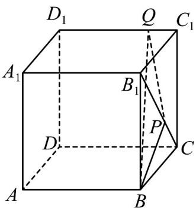
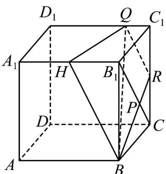
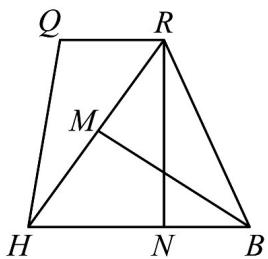

## 题型01 平面的概念及其表示

【典例1】正方体 $ABCD - A_{1}B_{1}C_{1}D_{1}$ 的棱长为4， $B_{1}P = 2PC$ ， $D_{1}Q = 3QC_{1}$ ，用经过 $B$ ， $P$ ， $Q$ 三点的平面截该

正方体，则所截得的截面面积为（）

A. $3\sqrt{15}$ B. $15\sqrt{3}$ C. $\frac{15\sqrt{15}}{4}$ D. $3\sqrt{21}$

【答案】D

【分析】先根据题意画出截面，再根据正方形的棱长以及梯形的面积公式即可求解·

【详解】解：如图所示：

延长BP交 $CC_{1}$ 于点R，则 $\frac{CR}{B_{1}B}=\frac{CP}{B_{1}P}=\frac{1}{2}$ ，即R为 $CC_{1}$ 中点，

连接QR，取 $A_{1}B_{1}$ 中点H，连接BH，则 $BH//QR$ ，

∴ B , H , Q , R 四点共面，

$$
B H = B R = 2 Q R = \sqrt {4 ^ {2} + 2 ^ {2}} = 2 \sqrt {5}, Q H = \sqrt {4 ^ {2} + 1 ^ {2}} = \sqrt {1 7}, R H = \sqrt {2 ^ {2} + (2 \sqrt {5}) ^ {2}} = 2 \sqrt {6}
$$

截面 BHQR 如图所示：

在 $\triangle BRH$ 中， $RH$ 边上的高 $BM = \sqrt{(2\sqrt{5})^2 - (\sqrt{6})^2} = \sqrt{14}$

记 $BH$ 边上的高为 $RN$

则 $BH\cdot RN = RH\cdot BM$

$\therefore RN = \frac{RH\cdot BM}{BH} = \frac{2\sqrt{6}\times\sqrt{14}}{2\sqrt{5}} = \frac{2\sqrt{21}}{\sqrt{5}}$

则所截得的截面面积为： $S=\frac{1}{2}\times3\sqrt{5}\times\frac{2\sqrt{21}}{\sqrt{5}}=3\sqrt{21}$

故选：D.

## 方法技巧

## 三种语言转换的注意事项

(1) 用文字语言、符号语言表示一个图形时，首先仔细观察图形有几个平面、几条直线且相互之间的位置关

系如何，试着用文字语言表示，再用符号语言表示。

(2) 符号语言的意义. 如点与直线的位置关系只能用“∈”或“∉”，直线与平面的位置关系只能用“⊂”或“∅”.

（3）由符号语言或文字语言画相应的图形时，要注意把被遮挡的部分画成虚线.

![[高中/课堂同步/题库/人教A版高中数学同步讲义(2026)/02_必修第二册/第八章 立体几何初步/专题8.4 空间点、直线、平面之间的位置关系（高效培优讲义）/题型01_平面的概念及其表示/questions/Q00069792.md]]
![[高中/课堂同步/题库/人教A版高中数学同步讲义(2026)/02_必修第二册/第八章 立体几何初步/专题8.4 空间点、直线、平面之间的位置关系（高效培优讲义）/题型01_平面的概念及其表示/questions/Q00069793.md]]
![[高中/课堂同步/题库/人教A版高中数学同步讲义(2026)/02_必修第二册/第八章 立体几何初步/专题8.4 空间点、直线、平面之间的位置关系（高效培优讲义）/题型01_平面的概念及其表示/questions/Q00069794.md]]
