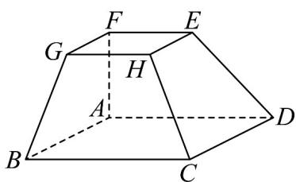

<!-- question-source:start -->
【变式1】如图，在多面体 $ABCDEFGH$ 中，四边形 $ABCD$ 和四边形 $EFGH$ 均为正方形，四边形 $ABGF$ 和四

边形 ADEF 均为梯形，其中 $AB \parallel FG$ ， $AD \parallel EF$ ，且 AB = 2FG。

(1)证明：B，D，E，G四点共面·

(2)证明：AF,BG,DE三条直线交于一点·
<!-- question-source:end -->

![[高中/课堂同步/题库/人教A版高中数学同步讲义(2026)/02_必修第二册/第八章 立体几何初步/专题8.4 空间点、直线、平面之间的位置关系（高效培优讲义）/题型02_点线共面/questions/answers/Q00069795A1.md]]
