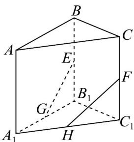

<!-- question-source:start -->
【变式3】如图，在三棱柱 $ABC - A_{1}B_{1}C_{1}$ 中， $E, F, G$ ， $H$ 分别为 $BB_{1}, CC_{1}, A_{1}B_{1}, A_{1}C_{1}$ 的中点，则下

列说法正确的是（）

A. $E, F, G, H$ 四点共面 B. $EF // GH$ C. $EG, FH, AA_{1}$ 三线共点 D. $\angle EGB_{1} = \angle FHC_{1}$
<!-- question-source:end -->

![[高中/课堂同步/题库/人教A版高中数学同步讲义(2026)/02_必修第二册/第八章 立体几何初步/专题8.4 空间点、直线、平面之间的位置关系（高效培优讲义）/题型02_点线共面/questions/answers/Q00069797A1.md]]
