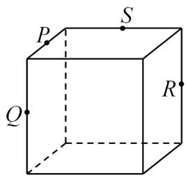
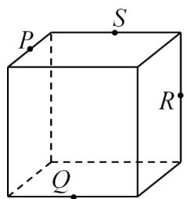
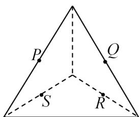
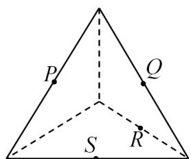
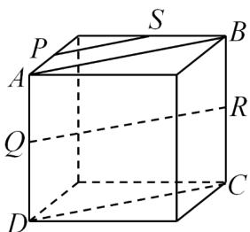
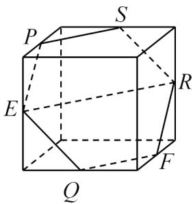
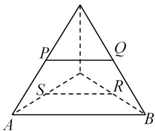
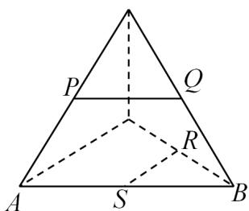

> [!faq]- 《专题8.4 空间点、直线、平面之间的位置关系（高效培优讲义）》官方解析
>
> > [!success]- **【答案】** A  B  C  D 
>
> > [!note]- **【分析】**
> > 利用空间中平行关系的转化可判断 $^{ABC}$ 正确，根据异面直线的定义可判断 $^{D}$ 错误。
>
> > [!note]- **【解析】**
> > 在 $^{A}$ 图中，分别连接PS,QR,AB,CD，由正方体可得四边形ABCD为矩形，则 $AB//CD$ ，
> > 因为P,S为中点，故PS//AB，则PS//QR，所以P,S,R,Q四点共面.
> >
> > 
> >
> > 在 $^{B}$ 图中，设E,F为所在棱的中点，分别连接PS,SR,RF,FQ,EQ,PE
> >
> > 
> >
> > 由 $^{A}$ 的讨论可得PS//ER，故P,S,E,R四点共面，
> >
> > 同理可得 $ER//QF$ ，故 $PS//QF$ ，同理可得 $EP//RF$ ， $SR//EQ$
> >
> > 故 $F \in$ 平面 $PRS$ ， $Q \in$ 平面 $PRS$ ，所以 $P, S, R, Q, E, F$ 六点共面。
> >
> > 在 $C$ 图中，由 $P, Q$ 为中点可得 $PQ \parallel AB$ ，同理 $RS \parallel AB$ ，
> >
> > 故 $PQ//RS$ ，所以 $P,S,R,Q$ 四点共面·
> >
> > 
> >
> > 在 $^{D}$ 图中，PQ,RS 为异面直线，四点不共面.
> >
> > 
> >
> > 故选 **D**.
