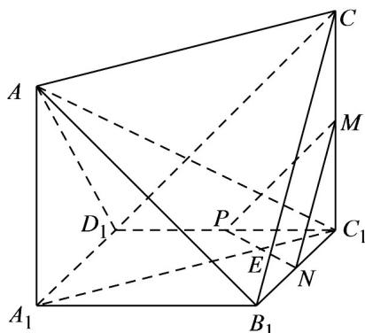

<!-- question-source:start -->
【变式2】在如图所示的七面体 $AA_{1}B_{1}C_{1}D_{1}C$ 中，四边形 $A_{1}B_{1}C_{1}D_{1}$ 为边长为2的正方形， $AA_{1}\perp$ 平面 $A_{1}B_{1}C_{1}D_{1}$ ， $CC_{1}\parallel AA_{1}$ ，且 $CC_{1}=AA_{1}=2$ ，M，N，P分别是 $C_{1}C$ ， $B_{1}C_{1}$ ， $C_{1}D_{1}$ 的中点·

(1)求点 $C_1$ 到平面MNP的距离；

(2)若直线 $A_{1}C_{1}$ 交 $PN$ 于点 $E$ ，直线 $AC_{1}$ 交平面 $MNP$ 于点 $F$ ，证明： $M$ ， $E$ ， $F$ 三点共线·
<!-- question-source:end -->

![[高中/课堂同步/题库/人教A版高中数学同步讲义(2026)/02_必修第二册/第八章 立体几何初步/专题8.4 空间点、直线、平面之间的位置关系（高效培优讲义）/题型03_三点共线/questions/answers/Q00069799A1.md]]
