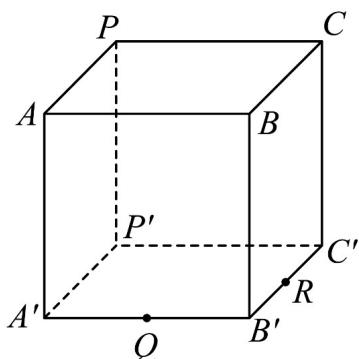

<!-- question-source:start -->
【变式1】如图，正四棱柱 $ABCP - A'B'C'P'$

(1)请在正四棱柱 $ABCP - A'B'C'P'$ 中，画出经过 $P$ 、 $Q$ 、 $R$ 三点的截面（无需证明）；

(2)若 Q、R 分别为 $A^{\prime}B^{\prime}$ 、 $B^{\prime}C^{\prime}$ 中点，证明：AQ、CR、 $BB^{\prime}$ 三线共点.
<!-- question-source:end -->

![[高中/课堂同步/题库/人教A版高中数学同步讲义(2026)/02_必修第二册/第八章 立体几何初步/专题8.4 空间点、直线、平面之间的位置关系（高效培优讲义）/题型04_三线共点问题/questions/answers/Q00069801A1.md]]
