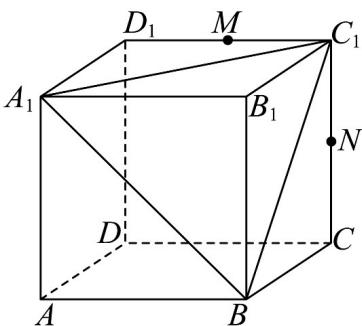
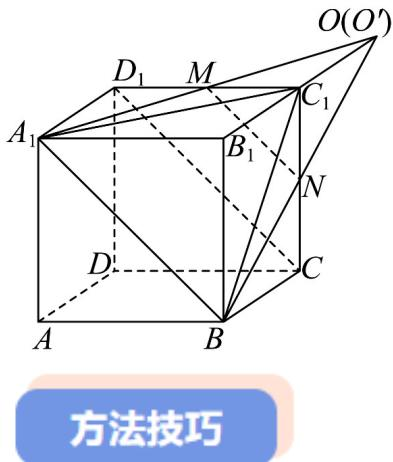

题型04 三线共点问题

【典例1】已知正方体 $ABCD - A_{1}B_{1}C_{1}D_{1}$ 中， $AB = 2$ ，点 $M$ ， $N$ 分别是线段 $C_1D_1$ ， $CC_1$ 的中点。

(1)求三棱锥 $M - A_{1}C_{1}B$ 的体积；

(2)求证：直线 $A_{1}M$ 、 $BN$ 、 $B_{1}C_{1}$ 三线共点.

【答案】(1) $\frac{2}{3}$

(2)证明见解析

【分析】（1）由等体积法结合棱锥的体积公式计算可得；（2）先证明直线 $A_{1}M, B_{1}C_{1}$ 相交，设交于 $O$ ，同理

可得直线 $B_{1}C_{1}, BN$ 相交于点 $O'$ ，再由 $B_{1}C_{1} = OC_{1} = O'C_{1}$ 可得三线共点.

【详解】（1） $V_{M-A_{1}C_{1}B}=V_{B-A_{1}C_{1}M}=\frac{1}{3}\times\frac{1}{2}\times1\times2\times2=\frac{2}{3}$

(2) 由于 $A_{1}B_{1}\parallel MC_{1}$ 且 $A_{1}B_{1} = 2MC_{1}$ ，故直线 $A_{1}M, B_{1}C_{1}$ 相交，设交于 $O$ ，

则 $B_{1}C_{1} = OC_{1}$

同理可得直线 $B_{1}C_{1}, BN$ 相交于点 $O'$ ，则 $B_{1}C_{1} = O'C_{1}$

故 $O'$ 与O重合，故直线 $A_{1}M$ 、BN、 $B_{1}C_{1}$ 三线相交于点O，

故直线 $A_{1}M$ 、BN、 $B_{1}C_{1}$ 三线交于一点。

证明多点共线、多线共点的常用方法

（1）证明三线共点常用的方法：先证明两条直线相交于一点，然后证明这个点在两个平面内，第三条线是这

两个平面的交线，于是该点在第三条直线上，从而得到三线共点．也可以先证明 $a$ ， $b$ 相交于一点 $A$ ， $b$ 与 $c$

相交于一点 $B$ ，再证明 $A, B$ 是同一点，从而得到 $a, b, c$ 三线共点。

(2) 类比线共点的证明方法，可得到三点共线的证明方法：

①首先找出两个平面的交线，然后证明这三点都是这两个平面的公共点，根据公理3，可推知这些点都在交

线上，即三点共线。

②选择其中两点确定一条直线，然后证明第三个点也在这条直线上.

![[高中/课堂同步/题库/人教A版高中数学同步讲义(2026)/02_必修第二册/第八章 立体几何初步/专题8.4 空间点、直线、平面之间的位置关系（高效培优讲义）/题型04_三线共点问题/questions/Q00069801.md]]
![[高中/课堂同步/题库/人教A版高中数学同步讲义(2026)/02_必修第二册/第八章 立体几何初步/专题8.4 空间点、直线、平面之间的位置关系（高效培优讲义）/题型04_三线共点问题/questions/Q00069802.md]]
![[高中/课堂同步/题库/人教A版高中数学同步讲义(2026)/02_必修第二册/第八章 立体几何初步/专题8.4 空间点、直线、平面之间的位置关系（高效培优讲义）/题型04_三线共点问题/questions/Q00069803.md]]
