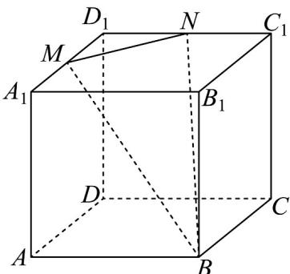

<!-- question-source:start -->
【变式3】如图，在棱长为 $6$ 的正方体 $ABCD - A_{1}B_{1}C_{1}D_{1}$ 中， $M, N$ 分别为棱 $A_{1}D_{1}, C_{1}D_{1}$ 的中点，则过 $M$

N, B 三点的平面截此正方体所得截面的周长是\_\_\_\_.

<!-- question-source:end -->

![[高中/课堂同步/题库/人教A版高中数学同步讲义(2026)/02_必修第二册/第八章 立体几何初步/专题8.4 空间点、直线、平面之间的位置关系（高效培优讲义）/题型05_截面问题/questions/answers/Q00069806A1.md]]
