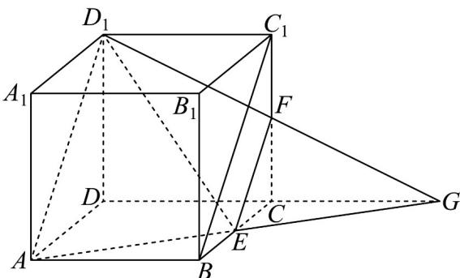

> [!faq]- 《专题8.4 空间点、直线、平面之间的位置关系（高效培优讲义）》官方解析
>
> > [!success]- **【答案】** B
>
> > [!note]- **【分析】**
> > 应用平面的基本性质画出截面图形，结合正方体的结构特征判断截面的形状·
>
> > [!note]- **【解析】**
> > 延长 $AE$ 交直线 $DC$ 于 $G$ ，连接 $D_{1}G$ 交 $CC_{1}$ 于 $F$ ，连接 $EF$ ，即 $AEFD_{1}$ 即为所求截面，
> >
> > 
> >
> > <!-- source-part:2 pages:51-87 -->
> >
> > 由题设有 $\frac{FG}{D_1G} = \frac{CG}{DG} = \frac{CE}{AD} = \frac{1}{2}$ 即 $F$ 为 $D_{1}G$ 的中点，则 $EF / / BC_{1}$ 且 $EF = \frac{1}{2} BC_{1}$
> >
> > 又 $AB / / DC / / D_{1}C_{1}$ ， $AB = DC = D_{1}C_{1}$ ，则 $ABC_{1}D_{1}$ 为平行四边形，
> >
> > 所以 $AD_{1} / / BC_{1}$ 且 $AD_{1} = BC_{1}$ ，故 $AD_{1} / / EF$ 且 $EF = \frac{1}{2} AD_{1}$ ，又 $AE = D_{1}F$ ，
> >
> > 所以 $AEFD_{1}$ 为等腰梯形.
> >
> > 故选 **B**
