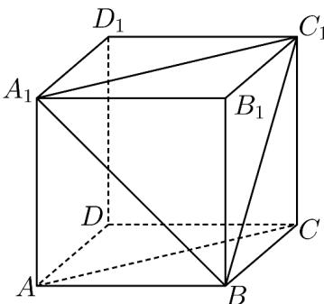

<!-- question-source:start -->
【变式2】已知 $ABCD - A_{1}B_{1}C_{1}D_{1}$ 是棱长为 $a$ 的正方体（如图）.

(1)正方体的哪些棱所在的直线与直线 $BC_{1}$ 是异面直线？

(2)求证直线 $AA_{1}$ 与 BC 垂直.

(3)求直线 $BC_{1}$ 与 $AC$ 的夹角.
<!-- question-source:end -->

![[高中/课堂同步/题库/人教A版高中数学同步讲义(2026)/02_必修第二册/第八章 立体几何初步/专题8.4 空间点、直线、平面之间的位置关系（高效培优讲义）/题型06_直线与直线的位置关系/questions/answers/Q00069808A1.md]]
