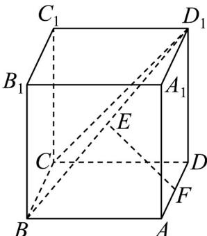

<!-- question-source:start -->
【变式3】如图，已知长方体 $ABCD - A_{1}B_{1}C_{1}D_{1}$ 中， $A_{1}A = AB$ ， $E$ ， $F$ 分别是 $BD_{1}$ 和 $AD$ 的中点，求证：

$$
C D _ {l} \bot E F.
$$

<!-- question-source:end -->

![[高中/课堂同步/题库/人教A版高中数学同步讲义(2026)/02_必修第二册/第八章 立体几何初步/专题8.4 空间点、直线、平面之间的位置关系（高效培优讲义）/题型06_直线与直线的位置关系/questions/answers/Q00069809A1.md]]
