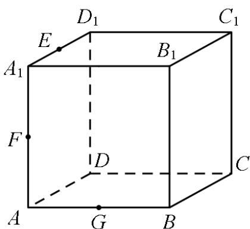

<!-- question-source:start -->
【变式2】如图，正方体 $ABCD - A_{1}B_{1}C_{1}D_{1}$ 中， $E, F, G$ 分别是棱 $A_{1}D_{1}, AA_{1}, AB$ 的中点·下列四个结论：

① $CD_{1} //FG$ ；②AC // 平面 EFG；③平面 BAC ⊥ 平面 EFG；④ $B_{1}D \perp EG$ ·其中正确结论的编号是\_\_\_\_

<!-- question-source:end -->

![[高中/课堂同步/题库/人教A版高中数学同步讲义(2026)/02_必修第二册/第八章 立体几何初步/专题8.4 空间点、直线、平面之间的位置关系（高效培优讲义）/题型08_平面与平面的位置关系/questions/answers/Q00069814A1.md]]
