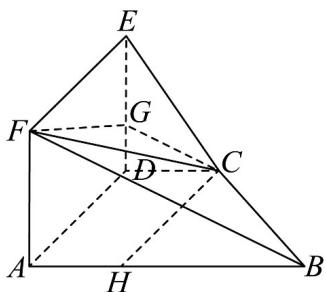
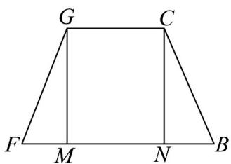

> [!faq]- 《专题8.4 空间点、直线、平面之间的位置关系（高效培优讲义）》官方解析
>
> > [!success]- **【答案】** (1)证明见解析 (2)16 (3)18
>
> > [!note]- **【分析】**
> > （1）由线面垂直的判定定理得 $DE \perp$ 平面ABCD，又由面面垂直的判定定理即可得证；
> >
> > (2) 先计算梯形 ABCD 的面积 S，利用四棱锥的体积公式即可求解；
> >
> > (3) 先证平面 $ABF \parallel$ 平面 $DCE$ ，过点 $C$ 作 $CG \parallel BF$ 交 $DE$ 于 $G$ ，计算 $BF, CG, FG, BC$ ，得四边形 $BCGF$ 为
> >
> > 等腰梯形，根据梯形的面积公式即可求解·
>
> > [!note]- **【解析】**
> > （1）由侧面 ADEF 是正方形有 $DE \perp AD$ ，又 $DE \perp CD, AD \cap DC = D$ ，
> >
> > 又 $AD, DC \subset$ 平面 $ABCD$ ，所以 $DE \perp$ 平面 $ABCD$ ，又 $DE \subset$ 平面 $ADEF$ ，
> >
> > 所以平面 ADEF ⊥ 平面 ABCD；
> >
> > (2) 由 (1) 有 $DE \perp$ 平面 $ABCD$ ，又 $AF \parallel DE$ ，所以 $AF \perp$ 平面 $ABCD$ ，
> >
> > 所以 $\angle ABF$ 为 $BF$ 与平面 $ABCD$ 所成角，即 $\angle ABF = 45^{\circ}$
> >
> > 又 $AD = 2CD = 4$ ，所以 $AF = AD = DE = 4$ ，即 $AB = AF = 4$
> >
> > 所以梯形 ABCD 的面积为 $S=\frac{1}{2}\times(CD+AB)\times AD=\frac{1}{2}\times(2+4)\times4=12$
> >
> > 所以四棱锥 E-ABCD 的体积为 $V=\frac{1}{3}\times S\times DE=\frac{1}{3}\times12\times4=16$ ；
> >
> > (3) 由侧面 ADEF 是正方形，得 DE // AF，DE ∉ 平面 ABF，AF ⊂ 平面 ABF，
> >
> > 所以 $DE \parallel$ 平面 $ABF$ ，又 $DC \parallel AB$ ， $DC \notin$ 平面 $ABF$ ， $AB \subset$ 平面 $ABF$ ，
> >
> > 所以 $DC \parallel$ 平面 $ABF$ ，又 $DC \cap DE = D$ ， $DC, DE \subset$ 平面 $DCE$ ，所以平面 $ABF \parallel$ 平面 $DCE$
> >
> > 连接 $CG$ ，平面 $CBF \cap$ 平面 $ABF = BF$ ，平面 $CBF \cap$ 平面 $CDE = CG$ ，则 $CG // BF$
> >
> > 由 AF = AB = 4 ，所以 $BF = \sqrt{AB^{2} + AF^{2}} = 4\sqrt{2}$
> >
> > 又 $\angle ABF = \angle DCG = 45^{\circ}$ ， $CD = 2$ ，所以 $DG = CD = 2$ ， $CG = \sqrt{DC^2 + DG^2} = 2\sqrt{2}$
> >
> > 由 $EG = 2$ ， $EF = 4$ ，所以 $FG = \sqrt{EF^2 + EG^2} = 2\sqrt{5}$
> >
> > 过点 C 作 CH // AD 交 AB 于 H ，
> >
> > 
> >
> > 由 $AD \perp AB$ 有 $CH \perp AB$ ，又 $CD = 2$ ， $CH = AD = 4$ ， $AH = CD = 2$ ，即 $BH = 2$ ，
> >
> > 所以 $BC = \sqrt{CH^{2} + HB^{2}} = 2\sqrt{5}$ ，所以四边形 BCGF 为等腰梯形，
> >
> > 如图作 $GM \perp BF, CN \perp BF$ ，所以 $MN = CG = 2\sqrt{2}$ ，
> >
> > $FM = \sqrt{2}$ ，所以 $GM = \sqrt{GF^2 - FM^2} = \sqrt{20 - 2} = 3\sqrt{2}$
> >
> > 所以等腰梯形 $BCGF$ 的面积为： $S = \frac{1}{2} (GC + BF) \cdot GM = \frac{1}{2} \times (2\sqrt{2} + 4\sqrt{2}) \times 3\sqrt{2} = 18$
> >
> > 
