<!-- source-part:1 pages:1-50 -->

## 专题8.5 空间直线、平面的平行

## 内容概览

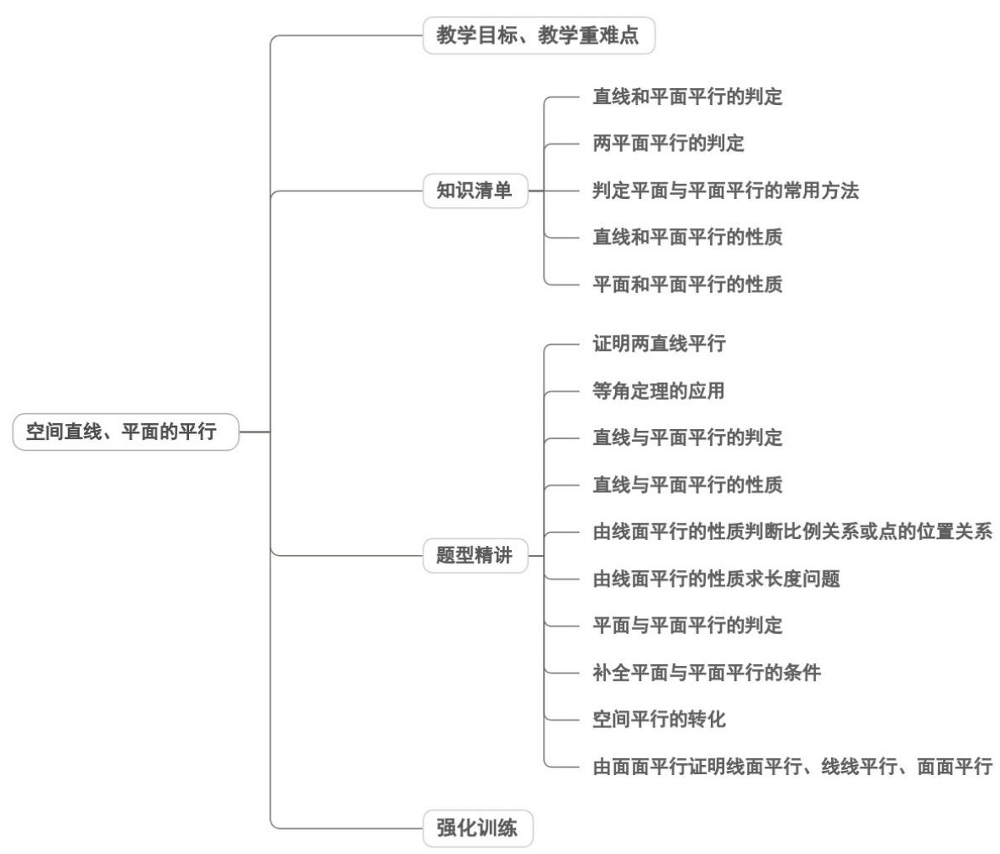

## 教学目标、教学重难点

<table><tr><td>教学目标</td><td>1.理解空间中直线与直线平行的基本事实4(平行公理)和等角定理,能运用其判断或证明空间两条直线平行及角的关系;2.掌握直线与平面平行、平面与平面平行的判定定理,明确定理的前提条件、文字表述、图形语言和符号表示,能准确应用定理解决线面、面面平行的判定问题;3.掌握直线与平面平行、平面与平面平行的性质定理,能利用性质定理实现线面平行到线线平行、面面平行到线线平行的转化,解决相关几何证明与计算;4.能清晰区分空间中直线与平面、平面与平面的位置关系,并用规范的几何语言(文字、图形、符号)表述。</td></tr><tr><td>教学重难点</td><td>1.重点核心定理的理解与掌握:直线与平面平行的判定定理(平面外一条直线与平面内一条直线平行,则直线与平面平行)、平面与平面平行的判定定理(一个平面内的两条相交直线与另一个平面平行,则两平面平行);2.难点综合问题的转化与求解:面对需要多次转化平行关系的综合题,难以理清线线、线面、面面之间的逻辑关联,缺乏解题思路;</td></tr></table>

## 知识清单

## 知识点 01 直线和平面平行的判定

1、文字语言：直线和平面平行的判定定理：平面外一条直线与此平面内的一条直线平行，则该直线与此平面

平行．简记为：线线平行，则线面平行．

2、图形语言：

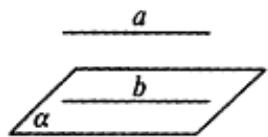

3、符号语言： $a \notin \alpha$ 、 $b \subset \alpha$ ， $a \parallel b \Rightarrow a \parallel \alpha$

4、知识点诠释：用该定理判断直线 $a$ 与平面 $\alpha$ 平行时，必须具备三个条件：

①直线 $a$ 在平面 $\alpha$ 外，即 $a\not\subset\alpha$ ；

②直线 b 在平面 $\alpha$ 内，即 $b \subset \alpha$ ；

③直线 a, b 平行，即 $a \parallel b$ .

这三个条件缺一不可，缺少其中任何一个，结论就不一定成立。

【即学即练】

1. 已知长方体 $ABCD - A_1B_1C_1D_1$ 中， $AB = 4$ ， $AD = AA_1 = 3$ .

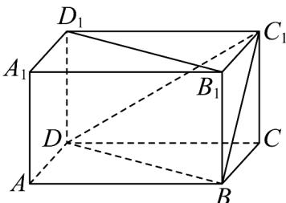

(1)求证： $B_{1}D_{1}\parallel$ 平面 $BC_{1}D$ ；

(2)求三棱锥 $C - BDC_{1}$ 的体积.

【答案】(1)证明见解析

(2)6

【分析】（ $^{1}$ ）由平行四边形可得线线平行，再由线面平行的判定定理得证；

(2) 根据棱锥的体积公式求解即可·

【详解】（1）在长方体 $ABCD - A_{1}B_{1}C_{1}D_{1}$ 中，

可得 $DD_{1} \parallel BB_{1}$ 且 $DD_{1} = BB_{1}$

所以四边形 $DD_{1}B_{1}B$ 是平行四边形

所以 $D_{1}B_{1} \parallel DB$

且 $D_{1}B_{1}\notin$ 平面 $DBC_{1}$ ， $DB\subset$ 平面 $DBC_{1}$

所以 $B_{1}D_{1}\parallel$ 平面 $BC_{1}D$ .

(2) 在长方体 $ABCD - A_{1}B_{1}C_{1}D_{1}$ 中，

$$
A B = 4, A D = A A = 3 \text {, 且} C C _ {1} \perp \text {平面} A B C D
$$

$$
\therefore V _ {C - B D C _ {1}} = V _ {C _ {1} - B D C}
$$

$$
V _ {C _ {1} - B D C} = \frac {1}{3} \cdot S _ {\triangle B D C} \cdot C C _ {1} = \frac {1}{3} \times \left(\frac {1}{2} \times 3 \times 4\right) \times 3 = 6.
$$

2．如图所示，在四棱锥 P-ABCD 中，底面 ABCD 是平行四边形，AC 与 BD 交于点 O，M 是 PC 的中点，

在 $DM$ 上取一点 $G$ ，过 $G$ 和 $AP$ 作平面交平面 $BDM$ 于 $GH$ ，求证： $AP \parallel GH$ .

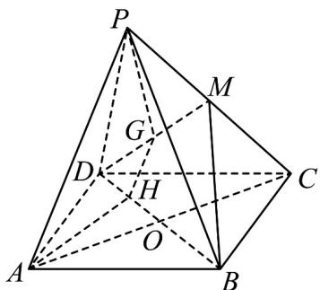

【答案】证明见解析

【分析】先证明线面平行，由 $AP \parallel$ 平面 BDM 的性质可得 $AP \parallel GH$ .

【详解】证明：如图，连接 $OM$ ·$\therefore O_{\text{是}} AC$ 的中点.

又∵ M 是 PC 的中点，∴ $AP \parallel OM$ .

又∵ $AP \not\subset$ 平面 BDM ， $OM \subset$ 平面 BDM ， ∴ $AP \parallel$ 平面 BDM ·

又∵ $AP \subset$ 平面 APGH ，平面 $APGH \cap$ 平面 BDM = GH

$\therefore AP \parallel GH$

## 知识点 02 两平面平行的判定

1、文字语言：如果一个平面内有两条相交直线与另一个平面平行，则这两个平面平行。

2、图形语言：

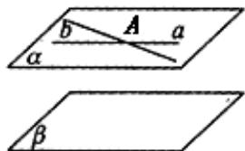

3、符号语言：若 $a \subset \alpha$ 、 $b \subset \alpha$ ， $a \cap b = A$ ，且 $a // \beta$ 、 $b // \beta$ ，则 $\alpha // \beta$

4、知识点诠释：

(1) 定理中平行于同一个平面的两条直线必须是相交的.

(2) 定理充分体现了等价转化的思想，即把面面平行转化为线面平行，可概述为：线面平行 $\Rightarrow$ 面面平行。

【即学即练】

1．三棱柱 $ABC-A_{1}B_{1}C_{1}$ 中，D,E 分别为 AB,AC 中点．若过 DE 的平面交 $A_{1}C_{1}$ 于 $E_{1}$ ，且 $BC_{1} //$ 平面 $E_{1}DE$ ，则

平面 $E_{1}DE / /$ 平面 $BCC_{1}B_{1}$ 成立吗？

【答案】成立

【分析】连接 $AC_{1}$ 交 $E_{1}E$ 于点 $F$ ，连接 $DF$ ，由 $BC_{1} / /$ 平面 $E_{1}DE$ 推得 $BC_{1} / / DF$ ，由线线平行可得 $DF / /$ 平面

$BCC_{1}B_{1}$ ，结合条件可得 $DE \parallel$ 平面 $BCC_{1}B_{1}$ ，由线面平行可证得面面平行。

【详解】

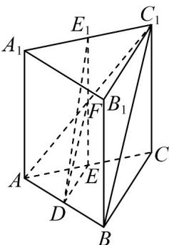

如图，连接 $AC_{1}$ 交 $E_{1}E$ 于点 F，连接 DF，因 $BC_{1} //$ 平面 $E_{1}DE$ ， $BC_{1} \subset$ 平面 $ABC_{1}$ ，

平面 $ABC_{1}\mathrm{I}$ 平面 $E_{1}DE = DF$ ，故 $BC_{1} / / DF$ ，又因 $DF\notin$ 平面 $BCC_{1}B_{1}$ ， $BC_{1}\subset$ 平面 $BCC_{1}B_{1}$

则 $DF \parallel$ 平面 $BCC_{1}B_{1}$ ，又 $D, E$ 分别为 $AB, AC$ 中点，则 $DE \parallel BC$ ，

因 $DE \notin$ 平面 $BCC_{1}B_{1}$ ， $BC \subset$ 平面 $BCC_{1}B_{1}$ ，则 $DE //$ 平面 $BCC_{1}B_{1}$ ，又 $DE \cap DF = D, DE, DF \subset$ 平面 $E_{1}DE$

故平面 $E_{1}DE \parallel$ 平面 $BCC_{1}B_{1}$

故结论成立.

2．如图，正方体 $ABCD-A_{1}B_{1}C_{1}D_{1}$ 的棱长为 3，点 M，N 分别在棱 $AA_{1}$ ， $A_{1}D_{1}$ 上，满足 $AM=D_{1}N=1$ ，点 Q

在正方体 $ABCD - A_1B_1C_1D_1$ 的内部或表面，且 $A_1Q //$ 平面 $C_1MN$ ，则点 $Q$ 组成的图形的面积是\_\_\_\_。

【答案】 $\frac{\sqrt{19}}{2}/\frac{1}{2}\sqrt{19}$

【分析】在 $B_{1}B, B_{1}C_{1}$ 上取点 $E, F$ ，使得 $BB_{1} = 3EB_{1}, B_{1}C_{1} = 3B_{1}F$ ，证得平面 $A_{1}EF // \text{平面 } C_{1}NM$ ，得到点 $Q$ 的轨

迹组成的图形为 $\triangle A_{1}EF$ ，在等腰三角形 $A_{1}EF$ 中，求得底边 $EF$ 上的高，即可求解

【详解】在 $B_{1}B, B_{1}C_{1}$ 上取点 E, F ，使得 $BB_{1} = 3EB_{1}, B_{1}C_{1} = 3B_{1}F$

分别连结 $EF, BC_{1}, AD_{1}$

因为 $A_{1}D_{1}=3D_{1}N$ ，可得 $A_{1}N//C_{1}F$ ，且 $A_{1}N=C_{1}F$ ，

所以四边形 $A_{1}FC_{1}N$ 为平行四边形，所以 $C_1N // A_1F$

由 $BB_{1} = 3EB_{1}$ 且 $B_{1}C_{1} = 3B_{1}F$ ，可得 $EF / / BC_{1}$

又由 $AA_{1} = 3AM$ 且 $A_{1}D_{1} = 3D_{1}N$ ，所以 $MN / / AD_{1}$

在正方体 $ABCD - A_{1}B_{1}C_{1}D_{1}$ 中，可得 $AD_{1} // BC_{1}$ ，所以 $EF // MN$ ，

因为 $A_{1}F \notin$ 平面 $C_{1}NM$ ，且 $C_{1}N \subset$ 平面 $C_{1}NM$ ，所以 $A_{1}F //$ 平面 $C_{1}NM$

同理可证 $EF$ // 平面 $C_1NM$

又因为 $A_{1}F \cap EF = F$ ，且 $A_{1}F, EF \subset$ 平面 $A_{1}EF$ ，所以平面 $A_{1}EF //$ 平面 $C_{1}NM$

因此点 $Q$ 的轨迹组成的图形为 $\triangle A_{1}EF$

在等腰三角形 $A_{1}EF$ 中， $A_{1}F = A_{1}E = \sqrt{10}, EF = \sqrt{2}$

可得底边 EF 上的高为 $\sqrt{A_{1}F^{2}-\left(\frac{EF}{2}\right)^{2}}=\frac{\sqrt{38}}{2}$

所以面积为 $\frac{1}{2} \times \sqrt{2} \times \frac{\sqrt{38}}{2} = \frac{\sqrt{19}}{2}$

故答案为： $\frac{\sqrt{19}}{2}$

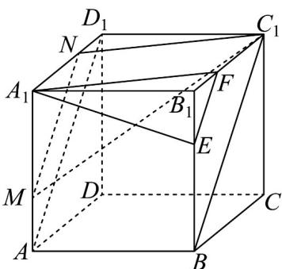

## 知识点 03 判定平面与平面平行的常用方法

1、利用定义：证明两个平面没有公共点，有时直接证明非常困难，往往采用反证法。

2、利用判定定理：要证明两个平面平行，只需在其中一个平面内找两条相交直线，分别证明它们平行于另一

个平面，于是这两个平面平行，或在一个平面内找到两条相交的直线分别与另一个平面内两条相交的直线平

行.

3、平面平行的传递性：即若两个平面都平行于第三个平面，则这两个平面互相平行。

## 【即学即练】

1. 下列四个正方体中，A,B,C 为所在棱的中点，D,E,F 为正方体的三个顶点，则能得出平面 ABC // 平面 DEF 的是（）

【答案】

A

B
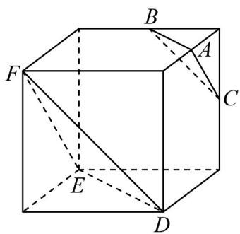

C

D

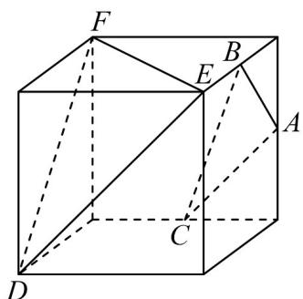

【答案】B

【分析】对于 $^{A}$ ，根据平面平行的定义，可得其正误；对于 $^{B}$ ，根据中位线定理可得线线平行，再根据面面

平行的判定，可得其正误；对于 $^{C}$ ，利用反证法，结合面面平行的性质，可得其正误；对于 $^{D}$ ，利用反证法，

根据面面平行的判定，可得其正误·

【详解】对于 $^{A}$ 选项，若平面ABC//平面DEF， $BC \subset$ 平面ABC，则 $BC \parallel$ 平面DEF

由图可知 BC 与平面 DEF 相交，故平面 ABC 与平面 DEF 不平行， $^{A}$ 不满足条件；

对于 $^{B}$ 选项，如图所示，连接NG

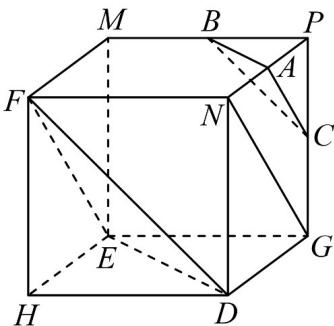

因为 $A$ 、 $C$ 分别为 $PN$ 、 $PG$ 的中点，则 $AC \parallel NG$ ，在正方体 $EHDG - MFNP$ 中， $FN \parallel EG$ 且 $FN = EG$

故四边形 EFNG 为平行四边形，所以 $NG \parallel EF$ ，所以 AC//EF

因为 $AC \not\subset$ 平面 DEF ， $EF \subset$ 平面 DEF ， 所以 $AC \parallel$ 平面 DEF ，

同理可证 $BC \parallel$ 平面 DEF ，因为 $AC \cap BC = C$ ，因此，平面 $ABC \parallel$ 平面 DEF ， $^{B}$ 满足条件；

对于 $C$ 选项，如图所示：

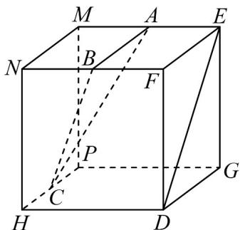

在正方体 PHDG-MNFE 中，若平面 ABC // 平面 DEF，且平面 DEF // 平面 MNHP

平面 ABC 与平面 MNHP 不重合，则平面 ABC // 平面 MNHP，与平面 ABC 与平面 MNHP 相交矛盾，

因此，平面 $ABC$ 与平面 $DEF$ 不平行， $C$ 不满足条件；

对于 $^{D}$ 选项，在正方体PDHG-FNEM中，连接PH、PM、MH，如图所示：

因为 $DH \parallel FM$ 且 $DH = FM$ ，则四边形 $DHMF$ 为平行四边形，则 $DF \parallel MH$ ，

因为 $DF \notin$ 平面 $PHM$ ， $MH \subset$ 平面 $PHM$ ，所以 $DF //$ 平面 $PHM$ ，

同理可证 $EF \parallel$ 平面 PHM ，因为 $DF \cap EF = F$ ，所以平面 $DEF \parallel$ 平面 PHM ，

若平面 $ABC$ // 平面 $DEF$ ，则平面 $ABC$ // 平面 $PHM$ ，与平面 $ABC$ 与平面 $PHM$ 相交矛盾，

故平面 ABC 与平面 DEF 不平行， $^{D}$ 不满足条件。

故选：B.

2. 某折叠餐桌的使用步骤如图所示，有如下检查项目：

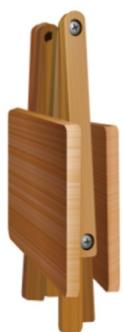
图1

图2

图3

项目①：折叠状态下（如图 $^{1}$ ），检查四条桌腿长相等；

项目②：打开过程中（如图2），检查 $OM = ON = O'M' = O'N'$ ；

项目③：打开过程中（如图2），检查 $OK = OL = O'K' = O'L'$

项目④：打开后（如图3），检查 $AB = A'B' = CD = C'D'$ ；

项目⑤：打开后（如图 $^{3}$ ），检查 $\angle1=\angle2=\angle3=\angle4=90^{\circ}$ .

下列检查项目的组合中，可以正确判断“桌子打开之后桌面与地面平行”的是（）
A. ①②③
B. ③④⑤
C. ②③⑤
D. ②④⑤

【答案】C

【分析】根据面面平行的判定，考查是否可以得到线线平行，转化为线面平行，得到面面平行。

【详解】项目①，折叠状态下（如图 $^{1}$ ），四条桌腿长相等时，桌面与地面不一定平行；

项目②，打开过程中（如图2），若 $OM = ON = O'M' = O'N'$ ，可以得到线线平行，从而得到面面平行；

项目③，打开过程中（如图2），检查 $OK = OL = O'K' = O'L'$ ，可以得到线线平行，从而得到面面平行；

项目④，打开后（如图 $^{3}$ ），检查 $AB = A'B' = CD = C'D'$ ，桌面与地面不一定平行；

项目⑤，打开后（如图3），检查 $\angle 1 = \angle 2 = \angle 3 = \angle 4 = 90^{\circ}$ ，可以得到线线平行，从而得到面面平行，

图1

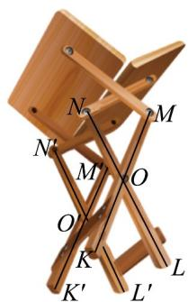
图2

图3

故选：C.

## 知识点 04 直线和平面平行的性质

1、文字语言：一条直线与一个平面平行，则过这条直线的任一平面与此平面的交线与该直线平行．简记为：

线面平行则线线平行.

2、符号语言：若 $a / / \alpha$ ， $a\subset \beta$ ， $\alpha \cap \beta = b$ ，则 $a / / b$ ：

3、图形语言：

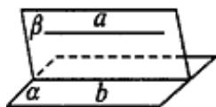

4、知识点诠释：

直线和平面平行的性质定理可简述为“若线面平行，则线线平行”。可以用符号表示：若 $a\| \alpha$ ， $\alpha \subset \beta$

$\alpha \cap \beta = b$ ，则 $a\| b$ .这个性质定理可以看作直线与直线平行的判定定理，用该定理判断直线 $a$ 与 $b$ 平行时，

必须具备三个条件：

(1) 直线 a 和平面 $\alpha$ 平行，即 $a \parallel \alpha$ ;

(2) 平面 $\alpha$ 和 $\beta$ 相交，即 $\alpha \cap \beta = b$ ；

(3) 直线 $a$ 在平面 $\beta$ 内，即 $a \subset \beta$ 。三个条件缺一不可，在应用这个定理时，要防止出现“一条直线平行于

一个平面，就平行于这个平面内一切直线”的错误。

【即学即练】

1．如图，在正方体 $ABCD-A_{1}B_{1}C_{1}D_{1}$ 中，E，H 分别为 $DD_{1}$ ，AB 的中点，点 F,G 分别在线段 BC， $CC_{1}$ 上，

且 $CF = CG = \frac{1}{4} BC$ ，则在 $F,G,H$ 这三点中任取两点确定的直线中，与平面 $ACE$ 平行的条数为

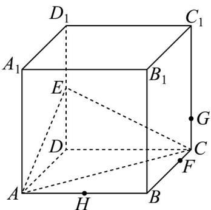

【答案】1

【分析】根据线面平行判定定理得出 $GH //$ 平面 $ACE$ ，再应用线面平行性质定理得出 $HF // AC$ 及 $FG // IN$

即可判断·

【详解】如图，取 $CE, CC_{1}$ 的中点I,M，IG//EM且 $IG=\frac{1}{2}EM$

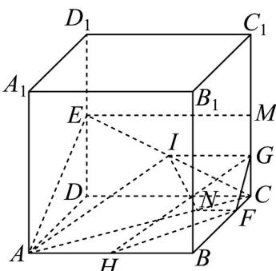

又 $AH // EM$ 且 $AH = \frac{1}{2} EM$ ，所以 $AH // IG$ 且 $AH = IG$ ，四边形 $AHGI$ 为平行四边形，则 $GH // AI$ ：

又 $GH \not\subset$ 平面 ACE ， $AI \subset$ 平面 ACE ， 故 $GH \parallel$ 平面 ACE ；

若 $HF / /$ 平面 $ACE$ ， $HF \subset$ 平面 $ABCD$ ，平面 $ABCD \cap$ 平面 $ACE = AC$ ，则 $HF / / AC$ ，矛盾；

过点 $F$ 作 $FN / / AB$ 交 $AC$ 于点 $N$ ，连结 $IN$ ， $CF = \frac{1}{4} CB$ ，则 $FN = \frac{1}{4} AB$

若 $FG / /$ 平面 $ACE$ ， $FG \subset$ 平面 $FGIN$ ，平面 $FGIN \cap$ 平面 $ACE = IN$ ，故 $FG / / IN$

又 $IG / / FN$ ，则四边形FGIN是平行四边形，但 $IG = \frac{1}{2} AB\neq NF$ ，矛盾.

故在 $F, G, H$ 这三点中任取两点确定的直线中，与平面 $ACE$ 平行的有 1 条。

故答案为：1.

2. 四棱锥 $P - ABCD$ 中底面 $ABCD$ 是平行四边形， $E$ 是 $PD$ 中点，平面 $EAB$ 与 $PC$ 交于 $F$ .

(1)求证： $CD / /$ 平面 $EAB$ ：

(2)求证： $F$ 是 $PC$ 中点.

【答案】 $^{(1)}$ 证明见解析

(2)证明见解析

【分析】（1）即证 $AB // CD$ ，利用线面平行的判定定理即可得证；

(2) 由 (1) 有 $CD //$ 平面 $EAB$ ，利用线面平行的性质定理即可得 $CD //EF$ ，进而得证·

【详解】（1）由底面ABCD是平行四边形，所以 $AB \parallel CD$

又 $AB \subset$ 平面 $EAB, CD \notin$ 平面 $EAB$

所以 $CD / /$ 平面 $EAB$ ；

(2) 由 (1) 有 CD // 平面 EAB，

又 $CD \subset$ 平面 PCD ，平面 $EAB \cap$ 平面 PCD = EF ，

所以 $CD / / EF$ ，

又 E 是 PD 中点，

所以 F 是 PC 中点·

## 知识点 05 平面和平面平行的性质

1、文字语言：如果两个平行平面同时与第三个平面相交，那么它们的交线平行。

2、符号语言：若 $\alpha // \beta$ ， $\alpha \cap \gamma = a$ ， $\beta \cap \gamma = b$ ，则 $a // b$ 。

3、图形语言：

4、知识点诠释：

（1）面面平行的性质定理也是线线平行的判定定理.

（2）已知两个平面平行，虽然一个平面内的任何直线都平行于另一个平面，但是这两个平面内的所有直线并

不一定相互平行，它们可能是平行直线，也可能是异面直线，但不可能是相交直线（否则将导致这两个平面

有公共点）.

【即学即练】

1. 如图，在棱长为 $^{2}$ 的正方体 $ABCD-A_{1}B_{1}C_{1}D_{1}$ 中，P 为 $DD_{1}$ 的中点，Q 为正方形 $AA_{1}D_{1}D$ 内一动点，且

$B_{1}Q//$ 平面 $BC_{1}P$ ，则点 Q 的轨迹的长度为 \_\_\_\_。

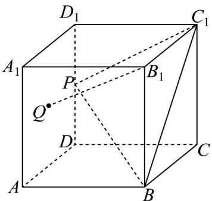

【答案】 $\sqrt{2}$

【分析】两次应用线面平行判定定理得出 $B_{1}GH\parallel$ 平面 $BC_{1}P$ ，进而得出点 Q 的轨迹为线段 GH，计算即可求

解·

【详解】如图，分别取 $AA_{1}$ ， $A_{1}D_{1}$ 的中点 H, G，连接 $B_{1}G$ ，GH， $HB_{1}$ ， $AD_{1}$ ，HP，

因为 $P$ 为 $DD_{1}$ 的中点，得 $HP / / A_{1}D_{1} / / B_{1}C_{1}$ ， $HP = A_{1}D_{1} = B_{1}C_{1}$ ，则四边形 $HPC_{1}B_{1}$ 是平行四边形，故 $B_{1}H / / PC_{1}$

因为 $B_{1}H \subset$ 平面 $B_{1}GH$ ， $PC_{1} \notin$ 平面 $B_{1}GH$ ，故 $PC_{1} / /$ 平面 $B_{1}GH$

又因为 $AB / / A_{1}B_{1} / / D_{1}C_{1}$ ， $AB = A_{1}B_{1} = D_{1}C_{1}$ ，则四边形 $ABC_{1}D_{1}$ 是平行四边形，故 $BC_{1} / / AD_{1}$

因为 $GH \parallel AD_{1}$ ，故 $BC_{1} \parallel GH$ ，又 $BC_{1} \not\subset$ 平面 $B_{1}GH$ ，GH $\backslash$ 平面 $B_{1}GH$ ，可得 $BC_{1} \parallel$ 平面 $B_{1}GH$ ，

且 $PC_{1} \cap BC_{1} = C_{1}$ ， $PC_{1}, BC_{1} \subset$ 平面 $BC_{1}P$ ，故平面 $B_{1}GH //$ 平面 $BC_{1}P$

又因为 $B_{1}Q / /$ 平面 $BC_{1}P$ ，故 $B_{1}Q \subset$ 平面 $B_{1}GH$ ，故点 $Q$ 的轨迹为线段 $GH$ ，其长为 $\sqrt{2}$

故答案为： $\sqrt{2}$

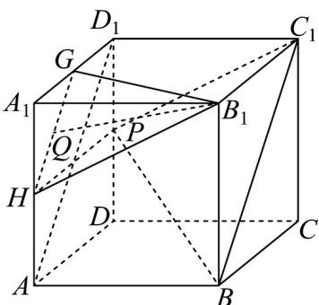

2. 设 $\alpha, \beta$ 是两个不同的平面，m 是直线且 $m \subset \beta$ ，则“ $m // \alpha$ ”是“ $\alpha // \beta$ ”的（）

【答案】
A．充分而不必要条件
B．必要而不充分条件
C．充要条件
D．既不充分也不必要条件

【答案】B

【分析】由面面平行的判定定理与性质定理判断充分性和必要性即可·

【详解】先验证充分性：当 $m \subset \beta$ 且 $m // \alpha$ 时，若 $\alpha$ 与 $\beta$ 相交，则得到 $m$ 与两平面交线平行，故 $\alpha // \beta$ 不一定

成立，即充分性不成立；

再验证必要性：当 $m \subset \beta$ 且 $\alpha // \beta$ 时， $m // \alpha$ ，必要性成立。

综上，在给定条件下，“ $m // \alpha$ ”是“ $\alpha // \beta$ ”的必要不充分条件。

故选：B.

## 题型精讲

![[高中/课堂同步/题库/人教A版高中数学同步讲义(2026)/02_必修第二册/第八章 立体几何初步/专题8.5 空间直线、平面的平行（高效培优讲义）/题型01_证明两直线平行/题型01_证明两直线平行.md]]
![[高中/课堂同步/题库/人教A版高中数学同步讲义(2026)/02_必修第二册/第八章 立体几何初步/专题8.5 空间直线、平面的平行（高效培优讲义）/题型02_等角定理的应用/题型02_等角定理的应用.md]]
![[高中/课堂同步/题库/人教A版高中数学同步讲义(2026)/02_必修第二册/第八章 立体几何初步/专题8.5 空间直线、平面的平行（高效培优讲义）/题型03_直线与平面平行的判定/题型03_直线与平面平行的判定.md]]
![[高中/课堂同步/题库/人教A版高中数学同步讲义(2026)/02_必修第二册/第八章 立体几何初步/专题8.5 空间直线、平面的平行（高效培优讲义）/题型04_直线与平面平行的性质/题型04_直线与平面平行的性质.md]]
![[高中/课堂同步/题库/人教A版高中数学同步讲义(2026)/02_必修第二册/第八章 立体几何初步/专题8.5 空间直线、平面的平行（高效培优讲义）/题型05_由线面平行的性质判断比例关系或点的位置关系/题型05_由线面平行的性质判断比例关系或点的位置关系.md]]
![[高中/课堂同步/题库/人教A版高中数学同步讲义(2026)/02_必修第二册/第八章 立体几何初步/专题8.5 空间直线、平面的平行（高效培优讲义）/题型06_由线面平行的性质求长度问题/题型06_由线面平行的性质求长度问题.md]]
![[高中/课堂同步/题库/人教A版高中数学同步讲义(2026)/02_必修第二册/第八章 立体几何初步/专题8.5 空间直线、平面的平行（高效培优讲义）/题型07_平面与平面平行的判定/题型07_平面与平面平行的判定.md]]
![[高中/课堂同步/题库/人教A版高中数学同步讲义(2026)/02_必修第二册/第八章 立体几何初步/专题8.5 空间直线、平面的平行（高效培优讲义）/题型08_补全平面与平面平行的条件/题型08_补全平面与平面平行的条件.md]]
![[高中/课堂同步/题库/人教A版高中数学同步讲义(2026)/02_必修第二册/第八章 立体几何初步/专题8.5 空间直线、平面的平行（高效培优讲义）/题型09_空间平行的转化/题型09_空间平行的转化.md]]
![[高中/课堂同步/题库/人教A版高中数学同步讲义(2026)/02_必修第二册/第八章 立体几何初步/专题8.5 空间直线、平面的平行（高效培优讲义）/题型10_由面面平行证明线面平行_线线平行_面面平行_典例1_如图_在棱/题型10_由面面平行证明线面平行_线线平行_面面平行_典例1_如图.md]]
![[高中/课堂同步/题库/人教A版高中数学同步讲义(2026)/02_必修第二册/第八章 立体几何初步/专题8.5 空间直线、平面的平行（高效培优讲义）/强化训练/强化训练.md]]
