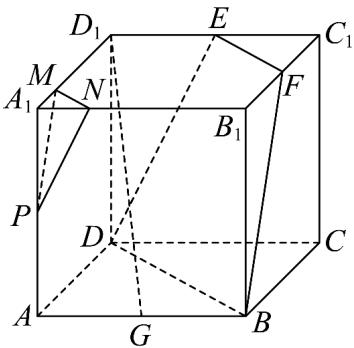

<!-- question-source:start -->
1．如图，在正方体 $ABCD-A_{1}B_{1}C_{1}D_{1}$ 中，点 G, E, F, P 分别为棱 AB, $D_{1}C_{1}$ , $B_{1}C_{1}$ , $AA_{1}$ 的中点，点 M 是棱

$A_{1}D_{1}$ 上的一点，且 $MD_{1}=\frac{3}{4}A_{1}D_{1}$

(1)求证： $D$ ， $B$ ， $F$ ， $E$ 四点共面；

(2)求证： $D_{1}G / /$ 平面DBFE；

$$
\frac {A _ {1} N}{A _ {1} B _ {1}}
$$

(3)棱 $A_{1}B_{1}$ 上是否存在一点 $N$ 使平面 $PMN//$ 平面 $DBFE$ ？若存在，求 $A_{1}B_{1}$ 的值；若不存在，请说明理由。
<!-- question-source:end -->

![[高中/课堂同步/题库/人教A版高中数学同步讲义(2026)/02_必修第二册/第八章 立体几何初步/专题8.5 空间直线、平面的平行（高效培优讲义）/强化训练/questions/answers/Q00069855A1.md]]
