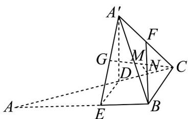

<!-- question-source:start -->
6. 如图，在 $Rt\triangle ABC$ 中， $\angle ABC = 90^{\circ}$ ，点 $D, E$ 分别在边 $AC, AB$ 上，且 $BE = \frac{1}{3} AB$ ， $CD = \frac{1}{3} AC$ ，将 $VADE$

绕着 $DE$ 旋转至 $\triangle A^{\prime}DE$ ，连接 $A'B$ ， $A'C$ ， $F,G$ 分别为线段 $A'C$ ， $A'E$ 的中点， $M,N$ 分别为线段 $CG,BF$ 的中

点，求证：MN//平面BCDE

<!-- question-source:end -->

![[高中/课堂同步/题库/人教A版高中数学同步讲义(2026)/02_必修第二册/第八章 立体几何初步/专题8.5 空间直线、平面的平行（高效培优讲义）/强化训练/questions/answers/Q00069860A1.md]]
