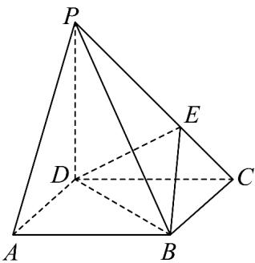

<!-- question-source:start -->
7. 如图，在四棱锥 $P - ABCD$ 中，底面四边形 $ABCD$ 是平行四边形， $E$ 是侧棱 $PC$ 上一点，且 $PE = 2EC$

(1)试确定侧棱 $PC$ 上一点 $\mathcal{Q}$ 的位置，使 $AQ / /$ 平面 $BDE$ ：

(2)在侧棱 $PB$ 上是否存在一点 $R$ ，使 $AR //$ 平面 $BDE$ ？若存在，求出 $RB$ 的值；若不存在，请说明理由。

$$
\frac {P R}{R B}
$$
<!-- question-source:end -->

![[高中/课堂同步/题库/人教A版高中数学同步讲义(2026)/02_必修第二册/第八章 立体几何初步/专题8.5 空间直线、平面的平行（高效培优讲义）/强化训练/questions/answers/Q00069861A1.md]]
