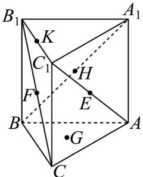

<!-- question-source:start -->
8. 如图，在三棱柱 $ABC - A_{1}B_{1}C_{1}$ 中，点 $E, F$ ， $H, K$ 分别为 $AC_{1}$ ， $CB_{1}$ ， $A_{1}B$ ， $B_{1}C_{1}$ 的中点， $G$ 为 $\mathrm{VABC}$ 的重

心．在下列平面中，恰有 $^{2}$ 条三棱柱的棱与其平行的是（）·

A. 平面 $EFB_{1}$ B. 平面 EFH C. 平面 EFK D. 平面 EFG
<!-- question-source:end -->

![[高中/课堂同步/题库/人教A版高中数学同步讲义(2026)/02_必修第二册/第八章 立体几何初步/专题8.5 空间直线、平面的平行（高效培优讲义）/强化训练/questions/answers/Q00069862A1.md]]
