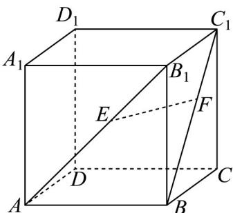

<!-- question-source:start -->
9．如图，在正方体 $ABCD-A_{1}B_{1}C_{1}D_{1}$ 中，E,F 分别为 $AB_{1}$ 与 $BC_{1}$ 上的点，且 AE=BF．求证：EF//平面 ABCD

<!-- question-source:end -->

![[高中/课堂同步/题库/人教A版高中数学同步讲义(2026)/02_必修第二册/第八章 立体几何初步/专题8.5 空间直线、平面的平行（高效培优讲义）/强化训练/questions/answers/Q00069863A1.md]]
