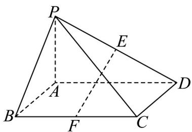

<!-- question-source:start -->
10．如图，在四棱锥 P-ABCD 中，底面 ABCD 是正方形， $PA \perp$ 底面 ABCD, PA = AD = 2, E 为 PD 的中点，F

为 $BC$ 的中点·

(1)证明： $EF \parallel$ 平面PAB；

(2)求异面直线 EF 与 PC 所成角的余弦值.
<!-- question-source:end -->

![[高中/课堂同步/题库/人教A版高中数学同步讲义(2026)/02_必修第二册/第八章 立体几何初步/专题8.5 空间直线、平面的平行（高效培优讲义）/强化训练/questions/answers/Q00069864A1.md]]
