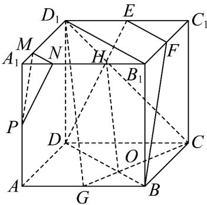
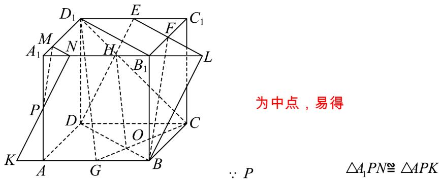

> [!faq]- 《专题8.5 空间直线、平面的平行（高效培优讲义）》官方解析
>
> > [!success]- **【答案】** (1)证明见解析 (2)证明见解析 (3)存在， $\frac{1}{4}$
>
> > [!note]- **【分析】**
> > （1）连接 $D_{1}B_{1}$ ，可证四边形 $DBB_{1}D_{1}$ 为平行四边形，得到 $DB//B_{1}D_{1}$ ，进而可证 $EF//BD$ 即可证明；
> >
> > (2) 连接 $D_{1}C$ 、GC 分别交 DE、DB 于点 H、O，连接 HO，即可证明 $\frac{GO}{CO} = \frac{BG}{CD} = \frac{1}{2}$ ，从而 $HO // D_{1}G$ 得到，
> >
> > 再根据线面平行判定证明即可；
> >
> > (3) 根据题意，首先 $MN//EF$ ，则 $\frac{A_1N}{A_1B_1} = \frac{1}{4}$ ，再由 $\frac{A_1N}{A_1B_1} = \frac{1}{4}$ 时，根据面面平行的判定证明即可。
>
> > [!note]- **【解析】**
> > （1）连接 $D_{1}B_{1}$ ，因为点 $E$ ， $F$ 分别为棱 $D_{1}C_{1}$ ， $B_{1}C_{1}$ 的中点，所以 $EF\parallel D_1B_1$
> >
> > 
> >
> > 又在正方体 $ABCD - A_{1}B_{1}C_{1}D_{1}$ 中 $DD_{1}\parallel BB_{1}$ 且 $DD_{1} = BB_{1}$
> >
> > 所以四边形 $DBB_{1}D_{1}$ 为平行四边形，
> >
> > 所以 $DB \parallel B_{1}D_{1}$
> >
> > 所以 $EF \parallel BD$ ，所以 $D, B, F, E$ 四点共面；
> >
> > (2) 连接 $D_{1}C$ 、 GC 分别交 DE、DB 于点 H、O，连接 HO，
> >
> > 在正方体 $ABCD - A_{1}B_{1}C_{1}D_{1}$ 中， $D_{1}E // DC$ 且 $D_{1}E = \frac{1}{2} DC$
> >
> > 所以 $\triangle HED_{1} - \triangle HDC$ ，则 $\frac{D_1H}{CH} = \frac{ED_1}{CD} = \frac{1}{2}$
> >
> > 同理可得 $\frac{GO}{CO} = \frac{BG}{CD} = \frac{1}{2}$
> >
> > 所以 $\frac{D_1H}{CH} = \frac{GO}{CO}$ ，所以 $HO\parallel D_1G$
> >
> > 又 $HO \subset$ 平面 DBFE， $D_{1}G \notin$ 平面 DBFE，所以 $D_{1}G //$ 平面 DBFE；
> >
> > (3) 存在，且 $\frac{A_{1}N}{A_{1}B_{1}}=\frac{1}{4}$ ，理由如下：
> >
> > 因为 $D_{1}M = \frac{3}{4} D_{1}A_{1}$
> >
> > 所以 $\frac{A_1N}{A_1B_1} = \frac{A_1M}{A_1D_1} = \frac{1}{4}$
> >
> > $\therefore MN//B_{1}D_{1}$
> >
> > 又 $EF / / B_{1}D_{1}$
> >
> > ∴MN//EF
> >
> > ∵ MN ∉ 平面 DBFE，EF ⊂ 平面 DBFE
> >
> > ∴MN// 平面 DBFE
> >
> > 延长 NP 交 BA 于 K，延长 EF 交 $A_{1}B_{1}$ 于 L，连接 BL，
> >
> > 
> >
> > $\therefore AK = A_{1}N = \frac{1}{4} AB, BK = \frac{5}{4} AB$
> >
> > $\because E, F_{\text{分别为}} C_1 D_1, B_1 C_1 \triangle EFC_1 \cong \triangle LFB_1$ 的中点，易得
> >
> > $\therefore B_{1}L = EC_{1} = \frac{1}{2} AB, NL = NB_{1} + B_{1}L = \frac{3}{4} AB + \frac{1}{2} AB = \frac{5}{4} AB,$
> >
> > $\therefore BK = NL$ ，又 $AB//A_1B_1$ ，即 $BK//NL$
> >
> > ∴ $KBLN$ 四边形 为平行四边形，
> >
> > ∴ NK // BL
> >
> > 又 $NK \not\subset$ 平面 DBFE， $BL \subset$ 平面 DBFE，
> >
> > 所以 $NK \parallel$ 平面 DBFE ，
> >
> > 又∵ $MN \cap NK = N$ , $MN, NK \subset$ 平面 PMN，
> > ∴ 平面 $PMN \parallel$ 平面 DBFE ，
> > 所以 $\frac{A_{1}N}{A_{1}B_{1}}=\frac{1}{4}$ 时，平面 $PMN \parallel$ 平面 DBFE .
