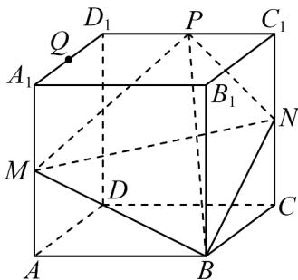
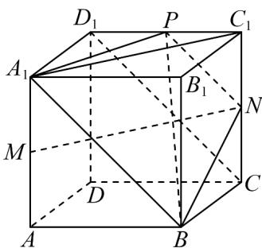
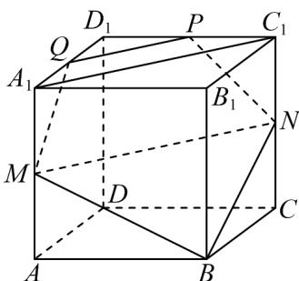
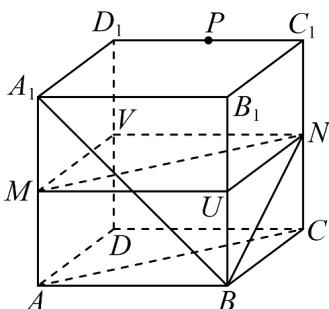

> [!faq]- 《专题8.5 空间直线、平面的平行（高效培优讲义）》官方解析
>
> > [!success]- **【答案】**  A．存在点 $Q\in$ 线段 $A_{1}D_{1}$ ，使B，N，P，Q四点共面 B．存在点 $Q\in$ 线段 $A_{1}D_{1}$ ，使PQ//平面MBN C．若点E满足 $\overline{BE}=\cos^{2}\theta\overline{BA}_{1}+\sin^{2}\theta\overline{BD}_{1}$ （ $\theta\in R$ ），则 $V_{E-BCD}$ 与点E位置有关 D．经过 C，M，B，N 四点的球的表面积为 $\frac{9\pi}{2}$
>
> > [!note]- **【分析】**
> > 对于 $^{A}$ ，由条件结合正方体性质证明 $PN \parallel A_{1}B$ ，由此证明 $A_{1}$ ，P，N，B四点共面，由此判断 $^{A}$ ，
> >
> > 对于 $^{B}$ ，取 $A_{1}D_{1}$ 中点为 $Q$ ，证明 $PQ // MN$ ，根据线面平行判定定理证明 $PQ //$ 平面 $MBN$ ，由此判断 $^{B}$ ，对于
> >
> > C，由条件证明点 $A_{1}$ ， $E$ ， $D_{1}$ 三点共线，由此证明点 $E$ 到平面ABCD的距离等于点 $A_{1}$ 到平面ABCD的距离，
> >
> > 结合锥体体积公式判断 C，对于 D，取 $BB_{1}$ 中点 U， $DD_{1}$ 中点 V，可得长方体 MUNV-ABCD 的外接球即过 C
> >
> > M，B，N 四点的球，再求长方体的外接球的半径及表面积即可判断 D.
>
> > [!note]- **【解析】**
> > 对于 $A$ ，连接 $A_{1}B$ ， $A_{1}P$ ， $CD_{1}$ ，正方体中易知 $CD_{1} // A_{1}B$
> >
> > P，N 分别是 $C_{1}D_{1}$ ， $C_{1}C$ 中点，则 $PN \parallel CD_{1}$ ，所以 $PN \parallel A_{1}B$
> >
> > 即 $A_{1}$ ， $P$ ， $N$ ， $B$ 四点共面，当 $Q$ 与 $A_{1}$ 重合时满足 $B$ ， $N$ ， $P$ ， $Q$ 四点共面， $\mathsf{A}$ 正确；
> >
> > 
> >
> > 对于 B，如图，取 $A_{1}D_{1}$ 中点为 Q，连接 PQ，QM， $A_{1}C_{1}$
> >
> > 因为 M ， N 分别是 $AA_{1}$ ， $CC_{1}$ 中点，则 $A_{1}M$ 与 $C_{1}N$ 平行且相等， $A_{1}C_{1}NM$ 是平行四边形，所以 $MN // A_{1}C_{1}$
> >
> > 又 P 是 $C_{1}D_{1}$ 中点，Q 是 $A_{1}D_{1}$ 中点，
> >
> > 所以 $PQ \parallel A_{1}C_{1}$ ，所以 $PQ \parallel MN$ ，
> >
> > 又 $MN \subset$ 平面 $BMN$ ， $PQ \notin$ 平面 $BMN$ ，所以 $PQ //$ 平面 $BMN$ ， $^{\mathrm{B}}$ 正确；
> >
> > 
> >
> > 选项 C，因为 $\overline{BE} = \cos^{2}\theta\overline{BA}_{1} + \sin^{2}\theta\overline{BD}_{1}$ ( $\theta \in R$ )
> >
> > 所以 $\left(\cos^2\theta +\sin^2\theta\right)\overline{BE} = \cos^2\theta \overline{BA}_1 + \sin^2\theta \overline{BD}_1$
> >
> > 所以 $\cos^{2}\theta\left(BE-BA_{1}\right)=\sin^{2}\theta\left(BD_{1}-BE\right)$ ，即 $\cos^{2}\theta A_{1}E=\sin^{2}\theta ED_{1}$ ，所以点 $A_{1}$ ，E， $D_{1}$ 三点共线，
> >
> > 又 $A_{1}D_{1} / /$ 平面ABCD，所以点 $E$ 到平面ABCD的距离等于点 $A_{1}$ 到平面ABCD的距离，
> >
> > 三棱锥 E-BCD 的体积 $V_{E-BCD}=V_{A_{1}-BCD}=\frac{1}{3}\times S_{\triangle BCD}\times A_{1}A=\frac{1}{3}\times2\times2=\frac{4}{3}$
> >
> > 所以 $V_{E-BCD}$ 为定值，与点 E 位置无关，C 错误；
> >
> > 选项 D，取 $BB_{1}$ 中点 U， $DD_{1}$ 中点 V，连接 MV，MU，NV，NU，
> >
> > 由已知多面体 MUNV - ABCD 为长方体，它的外接球就是过 B，C，M，N 四点的球，
> >
> > 所以过 $B$ ， $C$ ， $M$ ， $N$ 四点的球的直径为 $\sqrt{2^2 + 2^2 + 1^2} = 3$ ，半径为 $R = \frac{3}{2}$ ，表面积为 $S = 4\pi R^2 = 9\pi$ ，D错误.
> >
> > 
> >
> > 故选 **AB**
