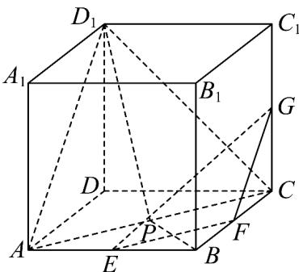

> [!faq]- 《专题8.5 空间直线、平面的平行（高效培优讲义）》官方解析
>
> > [!success]- **【答案】** C
>
> > [!note]- **【分析】**
> > 连接 $AC, D_{1}A, D_{1}C$ ，根据面面平行的判定定理，可证平面 $EFG \parallel$ 平面 $ACD_{1}$ ，结合题意，可得点 $P$ 在
> >
> > 直线 AC 上运动，再根据正方形的性质即可求解·
>
> > [!note]- **【解析】**
> > 连接 $AC, D_{1}A, D_{1}C$ ，因为 $E, F, G$ 分别是棱 $AB, BC, CC_{1}$ 的中点，
> >
> > 所以 $EF \parallel AC, FG \parallel BC_{1} \parallel AD_{1}$
> >
> > 又 $EF, FG \subset$ 平面 $EFG$ ， $AD_{1} \notin$ 平面 $EFG$ ， $AC \notin$ 平面 $EFG$
> >
> > $AD_{1}//$ 平面 EFG，AC// 平面 EFG， $AD_{1}, AC \subset$ 平面 $ACD_{1}$ ， $AD_{1} \cap AC = A$
> >
> > 所以平面 $EFG \parallel$ 平面 $ACD_{1}$ ，又 $D_{1} \in$ 平面 $ACD_{1}$
> >
> > 从而有 $D_{1}P \subset$ 平面 $ACD_{1}$ ，即点 $P \in$ 平面 $ACD_{1}$
> >
> > 又点 P 在平面 ABCD 内，平面 $ACD_{1} \cap$ 平面 ABCD = AC，
> >
> > 所以点 P 在直线 AC 上运动，
> >
> > 由正方形性质可得当点 $P$ 位于 $AC$ 中点时， $BP$ 最小，此时 $BP = \frac{1}{2} BD = \frac{1}{2}\sqrt{1^2 + 1^2} = \frac{\sqrt{2}}{2}$
> >
> > 故选：C
> >
> > 
