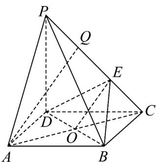
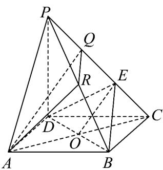

> [!faq]- 《专题8.5 空间直线、平面的平行（高效培优讲义）》官方解析
>
> > [!success]- **【答案】** (1)点 $Q$ 在侧棱 $PC$ 上满足 $PQ = \frac{1}{3} PC$ (2)存在， $\frac{PR}{RB} = 1$
>
> > [!note]- **【分析】**
> > （1）直线 AQ 在平面 APC 内运动，将 $AQ \parallel$ 平面 BDE 转化成平面 APC 内的限制条件，就可以限制
> >
> > 点 $Q$ 的位置.
> >
> > (2) 构造平面 $AQR \parallel$ 平面 BDE，利用面面平行的判定定理可说明 R 点的位置.
> >
> > 
>
> > [!note]- **【解析】**
> > （1）如图，连结 $AC$ ，交 $BD$ 于点 $O$ ，连结 $OE$ 。显然 $O$ 为 $AC$ 的中点。
> >
> > 若 $AQ \parallel$ 平面 BDE ，
> >
> > 因为 $AQ \subset$ 平面 PAC ，平面 $PAC \cap$ 平面 BDE = OE ，
> >
> > 所以 $AQ / / OE$ ，所以 $E$ 为 $QC$ 的中点．因为 $PE = 2EC$ ，所以 $PQ = \frac{1}{3} PC$
> >
> > 又当 $PQ = \frac{1}{3} PC$ 时，有 $AQ / / OE$ ，从而 $AQ / /$ 平面 $BDE$ .所以点 $Q$ 在侧棱 $PC$ 上满足 $PQ = \frac{1}{3} PC$
> >
> > (2) 如图，取 $PB$ 的中点 $R$ ，连结 $AR, QR$
> >
> > 
> >
> > 由（1）知 $Q$ 为 $PE$ 的中点，
> >
> > 所以 $QR //EB$ ，而 $QR\not\subset$ 平面 $BDE$ ， $BE \subset$ 平面 $BDE$ ，所以 $QR //$ 平面 $BDE$ 。
> >
> > 又因为 $AQ \parallel$ 平面 BDE ， $AQ \subset$ 平面 BDE ， $QR \subset$ 平面 BDE ，且 $AQ \cap QR = Q$
> >
> > 所以平面 $AQR \parallel$ 平面 BDE ，
> >
> > <!-- source-part:3 pages:101-106 -->
> >
> > 又 $AR \subset$ 平面 AQR ，所以 $AR \parallel$ 平面 BDE .
> >
> > 所以侧棱 $PB$ 的中点 $R$ 符合题意，此时 $\frac{PR}{RB} = 1$
