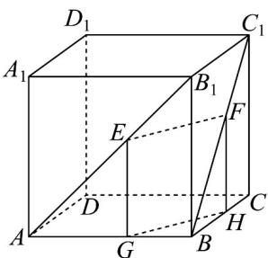
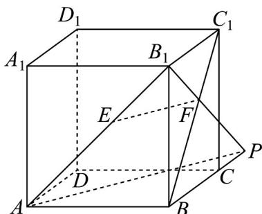
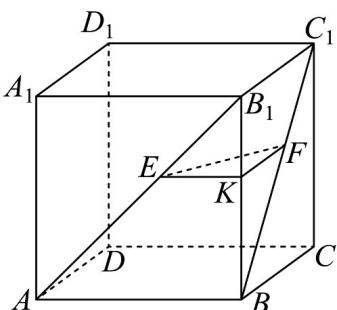

> [!faq]- 《专题8.5 空间直线、平面的平行（高效培优讲义）》官方解析
>
> > [!success]- **【答案】** 证明见解析
>
> > [!note]- **【分析】**
> > 将 $EF$ 放入一个平面，法一、法二：将 $EF$ 放入一个与平面ABCD相交的平面，通过证明“线线平行”
> >
> > 来证得“线面平行”；法三：将 $EF$ 放入一个与平面ABCD平行的平面，通过证明“面面平行”来证得“线面平行”。
>
> > [!note]- **【解析】**
> > 法一：如图，过点 $E$ 作 $EG // B_1B$ 交 $AB$ 于点 $G$ ，过点 $F$ 作 $FH // B_1B$ 交 $BC$ 于点 $H$ ，连结 $GH$ ，显然 $EG // FH$
> >
> > 
> >
> > 因为 $ABCD - A_{1}B_{1}C_{1}D_{1}$ 是正方体，所以 $B_{1}B = C_{1}C$ ， $AB_{1} = BC_{1}$
> >
> > 又因为 $\frac{EG}{B_1B} = \frac{AE}{AB_1}$ ， $\frac{FH}{C_1C} = \frac{BF}{BC_1}$ ，且 $AE = BF$ ，所以 $EG = FH$ ，所以四边形EGHF是平行四边形，从而 $EF / / GH$
> >
> > 因为 $EF \notin$ 平面 $ABCD$ , $GH$ 平面 $ABCD$ , 所以 $EF$ // 平面 $ABCD$ .
> >
> > 法二：如图，连结 $B_{1}F$ 并延长，与直线 $BC$ 相交于点 $P$ ，连结 $AP$ ：
> >
> > 
> >
> > 因为 $ABCD - A_{1}B_{1}C_{1}D_{1}$ 是正方体，所以 $B_{1}C_{1} // BC$ ， $AB_{1} = BC_{1}$
> >
> > 又因为 $AE = BF$ ，所以 $\frac{AE}{AB_1} = \frac{BF}{BC_1} = \frac{PF}{PB_1}$ ，从而 $EF / / AP$
> >
> > 因为 $EF \notin$ 平面 $ABCD$ ， $AP \subset$ 平面 $ABCD$ ，所以 $EF //$ 平面 $ABCD$ 。
> >
> > 法三：如图，过点 $E$ 作 $EK / / AB$ 交 $B_{1}B$ 于点 $K$ ，连结 $KF$ ，显然 $\frac{BK}{BB_1} = \frac{AE}{AB_1}$
> >
> > 
> >
> > 因为 $EK \notin$ 平面 $ABCD$ ， $AB \subset$ 平面 $ABCD$ ，所以 $EK //$ 平面 $ABCD$
> >
> > 因为 $ABCD - A_{1}B_{1}C_{1}D_{1}$ 是正方体，所以 $AB_{1} = BC_{1}$ ， $B_{1}C_{1} // BC$ ，
> >
> > 又因为 $AE = BF$ ，所以 $\frac{AE}{AB_1} = \frac{BF}{BC_1}$ 故 $\frac{BK}{BB_1} = \frac{BF}{BC_1}$
> >
> > 所以 $KF // B_{1}C_{1}$ ，从而 $KF // BC$ ，
> >
> > 因为 $KF \notin$ 平面 ABCD ， $BC \subset$ 平面 ABCD ，所以 $KF \parallel$ 平面 ABCD ，
> >
> > 又 $EK \subset$ 平面 $EKF$ ， $KF \subset$ 平面 $EKF$ ，且 $EK \cap KF = K$
> >
> > 所以平面 EKF // 平面 ABCD，
> >
> > 因为 $EF \subset$ 平面 $EKF$ ，所以 $EF //$ 平面 $ABCD$ 。
