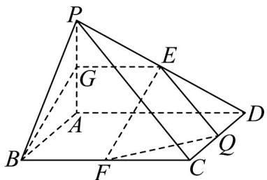

> [!faq]- 《专题8.5 空间直线、平面的平行（高效培优讲义）》官方解析
>
> > [!success]- **【答案】** (1)证明见解析 (2) $\frac{\sqrt{15}}{5}$
>
> > [!note]- **【分析】**
> > （1）要证明线面平行，需证明该线段与平面内的一条线段平行即可，即证明 $EF // BG$
> >
> > (2) 作出辅助线，确定异面直线 EF, PC 所成的角，然后根据边角关系求出其余弦值.
>
> > [!note]- **【解析】**
> > （1）证明：取 $PA$ 中点 $G$ ，连接 $EG$ 、 $BG$ .
> >
> > 因 E 为 PD 中点，G 为 PA 中点，故 EG 为 $\triangle PAD$ 中位线，得 $EG \parallel AD$ 且 $EG = \frac{1}{2} AD$
> >
> > 又底面 ABCD 是正方形，F 为 BC 中点，故 $BF \parallel AD$ 且 $BF = \frac{1}{2} AD$
> >
> > 所以 $EG / / BF$ 且 $EG = BF$ ，所以四边形 $EGBF$ 为平行四边形，故 $EF / / BG$
> >
> > 又 $BG \subset$ 平面 $PAB, EF \notin$ 平面 $PAB$ , 故 $EF //$ 平面 $PAB$ .
> >
> > (2) 取 CD 的中点 Q，连接 EQ, EQ 为 $\triangle PDC$ 的中位线，所以 $EQ \parallel PC, EQ = \frac{1}{2}PC$
> >
> > 故异面直线 EF 与 PC 所成角等于 EF 与 EQ 所成角，即 $\angle QEF$ .
> >
> > 在正方形 $ABCD$ 中， $AB = AD = 2, PA = 2$ 且 $PA \perp$ 底面 $ABCD$ ，故 $\triangle PAB$ 为直角三角形，
> >
> > $G$ 为 $PA$ 中点，得 $PG = AG = 1, BG = \sqrt{AB^2 + AG^2} = \sqrt{2^2 + 1^2} = \sqrt{5}$ .
> >
> > 由（1）知 $EF = BG = \sqrt{5}\cdot PC$ 为 $\mathrm{Rt}^{\triangle}$ PAC的斜边， $AC = \sqrt{AB^2 + AD^2} = 2\sqrt{2}$
> >
> > 故 $PC = \sqrt{PA^{2} + AC^{2}} = 2\sqrt{3}$ ，所以 $EQ = \sqrt{3}$
> >
> > 又 CF = 1, CQ = 1 ，所以 $FQ = \sqrt{2}$ .
> >
> > 在 $\triangle QEF$ 中， $EF = \sqrt{5}, EQ = \sqrt{3}, FQ = \sqrt{2}$ ，由余弦定理得
> >
> > $$
> > \cos \angle Q E F = \frac {E F ^ {2} + E Q - F Q ^ {2}}{2 E F \cdot E Q} = \frac {\left(\sqrt {5}\right) ^ {2} + (\sqrt {3}) ^ {2} - (\sqrt {2}) ^ {2}}{2 \times \sqrt {5} \times \sqrt {3}} = \frac {\sqrt {1 5}}{5}.
> > $$
> >
> > $$
> > \sqrt {1 5}
> > $$
> >
> > 所以异面直线 $EF$ 与 $PC$ 所成角的余弦值为 5 ·
> >
> > 
