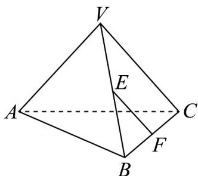

<!-- question-source:start -->
【变式2】已知三棱锥 $V - ABC$ 满足 $VC = VA = BA = BC = AC = 2$ ， $VB = \frac{\sqrt{3}}{2}$

(1)证明：直线 $AB$ 与直线 $VC$ 是异面直线；

(2)若 E 为 VB 的中点，F 为 BC 的中点，求异面直线 AB 与 EF 所成角的余弦值.
<!-- question-source:end -->

![[高中/课堂同步/题库/人教A版高中数学同步讲义(2026)/02_必修第二册/第八章 立体几何初步/专题8.5 空间直线、平面的平行（高效培优讲义）/题型01_证明两直线平行/questions/answers/Q00069827A1.md]]
