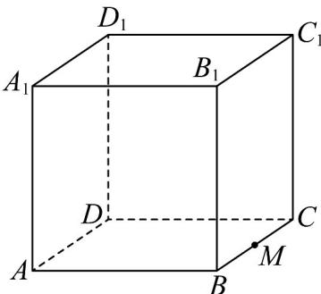
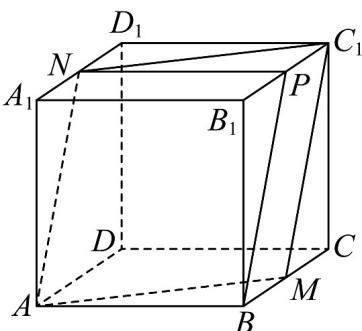

## 题型01 证明两直线平行

【典例1】如图，在棱长为 $^{1}$ 的正方体 $ABCD-A_{1}B_{1}C_{1}D_{1}$ 中，点M为棱BC的中点，则由A、M、 $C_{1}$ 三点所

确定的平面截该正方体所得截面的面积为（）

A. $\frac{\sqrt{3}}{2}$ B. $\frac{\sqrt{6}}{4}$ C. $\frac{\sqrt{6}}{2}$ D. $\frac{3\sqrt{3}}{4}$

【答案】C

【分析】根据正方体的几何性质结合空间中的直线与直线平行的判定定理求解出截面的形状进而再求截面面积即可·
【详解】如图所示，分别取 $A_{1}D_{1},B_{1}C_{1}$ 的中点N,P，连接 $C_{1}M,AM,C_{1}N,AN,BP,NP$ ，
由 $NP//A_{1}B_{1}//AB$ 且 $NP=A_{1}B_{1}=AB$ ，得ANPB是平行四边形，则AN//BP，

又 $BM / / C_1P$ 且 $BM = C_1P$ ，得 $BMC_{1}P$ 是平行四边形，得 $BP / / MC_{1}$ ，所以 $AN / / MC_{1}$ 则 $A,N,C_1,M$ 共面，故平面 $AC_{1}M$ 截该正方体所得的截面为 $ANC_{1}M$ ：

又正方体 $ABCD - A_{1}B_{1}C_{1}D_{1}$ 的棱长为 1， $AM = MC_{1} = NC_{1} = NA, AC_{1} = \sqrt{3}, MN = \sqrt{2}$ ，

$MN\perp AC_{1}$ ，故 $ANC_{1}M$ 的面积为 $S = \frac{1}{2}\times \sqrt{2}\times \sqrt{3} = \frac{\sqrt{6}}{2}$

故选:C.

## 方法技巧

证明两直线平行的常用方法

（1）利用平面几何的结论，如平行四边形的对边，三角形的中位线与底边；

(2) 定义法：即证明两条直线在同一个平面内且两直线没有公共点；

（3）利用基本事实4：找到一条直线，使所证的直线都与这条直线平行.

![[高中/课堂同步/题库/人教A版高中数学同步讲义(2026)/02_必修第二册/第八章 立体几何初步/专题8.5 空间直线、平面的平行（高效培优讲义）/题型01_证明两直线平行/questions/Q00069826.md]]
![[高中/课堂同步/题库/人教A版高中数学同步讲义(2026)/02_必修第二册/第八章 立体几何初步/专题8.5 空间直线、平面的平行（高效培优讲义）/题型01_证明两直线平行/questions/Q00069827.md]]
