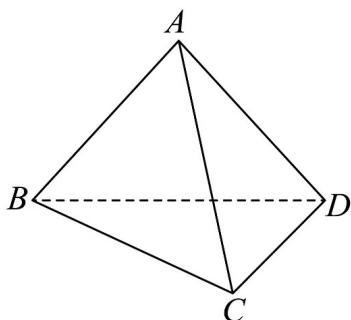

<!-- question-source:start -->
【变式2】如图，已知三棱锥 A-BCD，三角形 ABD 为等边三角形， $BD = AC$ ， $BC \perp CD$ 。

(1)若点 $O$ 为 $BD$ 的中点，证明： $AO \perp OC$ ；

(2)当 $BC = CD$ 时，求异面直线 $AB$ 与 $CD$ 所成角的余弦值；

(3)当异面直线 $AB$ 与 $CD$ 所成角的余弦值为 $\frac{1}{4}$ 时，求 $\frac{BC}{CD}$ 的值.
<!-- question-source:end -->

![[高中/课堂同步/题库/人教A版高中数学同步讲义(2026)/02_必修第二册/第八章 立体几何初步/专题8.5 空间直线、平面的平行（高效培优讲义）/题型02_等角定理的应用/questions/answers/Q00069829A1.md]]
