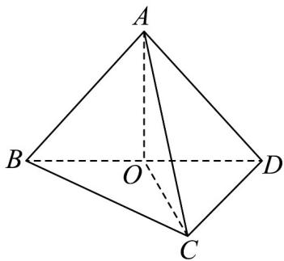
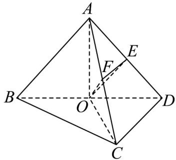

> [!faq]- 《专题8.5 空间直线、平面的平行（高效培优讲义）》官方解析
>
> > [!success]- **【答案】** (1)证明见解析 (2) $\frac{\sqrt{2}}{4}$ (3) $\sqrt{3}$
>
> > [!note]- **【分析】**
> > （1）通过直角三角形和等边三角形的性质，求出 $AO, OC$ ，即可证明 $AO \perp OC$ .
> >
> > (2) 取 $AC, AD$ 中点 $E, F$ ，连接 $OF, EF, OE$ ，将异面直线 $AB$ 与 $CD$ 所成角变为 $OE$ 与 $EF$ 所成的角 $\angle OEF$ ，利
> >
> > 用余弦定理即可求解·
> >
> > (3) 根据第二问的求解过程，表示出 EF，即可求解.
>
> > [!note]- **【解析】**
> > （1）设 $BD = AC = 2$ ，取 $BD$ 中点 $O$ ，连接 $OA, OC$ ， $\therefore OD = 1$
> >
> > ∵ $\triangle ABD$ 为等边三角形，O 为 BD 中点，
> >
> > $$
> > \therefore B D = A D = A C = 2, A O \perp B D
> > $$
> >
> > ∵ 在 $\triangle BCD$ 中，O 为中点，BC ⊥ CD
> >
> > $\therefore OC = \frac{1}{2} BD = 1$
> >
> > ∵ 在 $\triangle AOD$ 中，AD = 2, OD = 1，∴ $AO = \sqrt{3}$
> >
> > ∵ 在 $\triangle AOC$ 中， $AO = \sqrt{3}, OC = 1, AC = 2$ ，∴ $AO \perp OC$ .
> >
> > 
> >
> > 
> >
> > (2) 设 BD = AC = 2，取 BD 中点 O，连接 OA, OC，∴ OD = 1
> >
> > 取 $AC, AD$ 中点 $E, F$ ，连接 $OF, EF, OE$ ，由（1）得 $OF = \frac{1}{2} AC = 1$ ， $BD = AB = AC = 2$
> >
> > 在 $\triangle ACD, \triangle ABD$ 中， $\because E, F, O$ 为 $AD, AC, BD$ 中点，
> >
> > $\therefore OE//AB, EF//CD$ 且 $OE=\frac{1}{2}AB=1, EF=\frac{1}{2}CD$
> >
> > 故异面直线 AB 与 CD 所成角为 OE 与 EF 所成的角 $\angle OEF$ ，
> >
> > 在 $\triangle BCD$ 中， $BC = CD, BD = 2, BC \perp CD$ ，
> >
> > $$
> > \therefore E F = \frac {1}{2} C D = \frac {\sqrt {2}}{2}
> > $$
> >
> > 在 $\triangle OEF$ 中， $\cos \angle OEF = \frac{OE^2 + EF^2 - OF^2}{2 \times OE \times EF} = \frac{\sqrt{2}}{4}$
> >
> > 故异面直线 $AB$ 与 $CD$ 所成角的余弦值为 4
> >
> > $$
> > \frac {\sqrt {2}}{4}
> > $$
> >
> > (3) 设 EF = x, BD = AC = 2
> >
> > $\because$ 异面直线 $AB$ 与 $CD$ 所成角的余弦值为 $\frac{1}{4}$
> >
> > 由（2）可知 $\cos \angle OEF = \frac{OE^2 + EF^2 - OF^2}{2\times OE\times EF} = \frac{1}{4}$
> >
> > $\therefore x=\frac{1}{2}$ ，故 CD=1，
> >
> > 在 $\triangle BCD$ 中， $CD=1,BD=2,BC\perp CD$ ，
> >
> > $\therefore BC=\sqrt{3}$ ，故 $\frac{BC}{CD}=\sqrt{3}$
