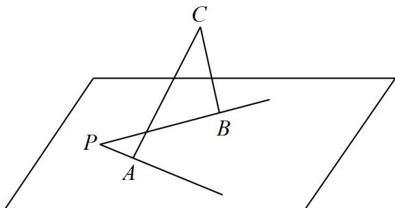

> [!faq]- 《专题8.5 空间直线、平面的平行（高效培优讲义）》官方解析
>
> > [!success]- **【答案】** B
>
> > [!note]- **【分析】**
> > 对于①，如果一个角的两边与另一个角的两边分别平行，则这两个角相等或互补，据此判断；对于
> >
> > ②，根据等角定理判断；对于③，空间两条直线的垂直包括异面垂直，此时两个角有可能不相等且不互补，
> >
> > 据此判断·
>
> > [!note]- **【解析】**
> > - **对于①**：，这两个角也可能互补，故①错误；根据等角定理，②显然正确；
> > - **对于③**：，如图所示，
> >
> > 
> >
> > $BC^{\perp}PB$ ， $AC^{\perp}PA$ ， $\angle ACB$ 的两条边分别垂直于 $\angle APB$ 的两条边，但这两个角不一定相等，也不一定互补，故
> > - **③**：错误．所以正确的命题有 $^{1}$ 个．
> >
> > 故选 **B**
