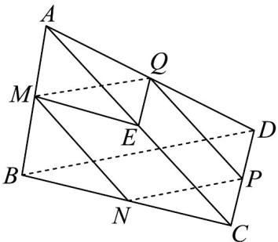

## 题型02 等角定理的应用

【典例1】如图所示，在四面体 $A - BCD$ 中， $M, N, P, Q, E$ 分别是 $AB, BC, CD, AD, AC$ 的中点，则下列说

法正确的是（）

A. 四边形 $MNPQ$ 是菱形 B. $\angle QME = \angle DBC$ C. $\triangle BCD \sim \triangle MEQ$ D. 四边形 $MNPQ$ 为矩形

【答案】BC

【分析】由由等角定理即可判断 BC，由三角形的中位线即可判断四边形形状判断 A，D.

【详解】由三角形中位线的性质知 $MQ / / BD$ ， $MQ = \frac{1}{2} BD$ ， $NP / / BD$ ， $NP = \frac{1}{2} BD$

所以 $MQ // NP, MQ = NP$ ，所以四边形 $MNPQ$ 为平行四边形，但不能确定是否为菱形或矩形，故 $AD$ 不正确。

在 VABC 中中位线定理得 ME // BC, 同理在 $\triangle ABD$ 中，由中位线定理得 MQ // BD，

所以由等角定理知， $\angle QME = \angle DBC$ ，所以 B 正确；

在 $\triangle ADC$ 中，由中位线定理得 $QE // DC$ ，所以 $ME // BC, MQ // BD, QE // DC,$

所以由等角定理可知， $\angle QME = \angle DBC$ ， $\angle QEM = \angle DCB$ ， $\angle MQE = \angle BDC$ ，

所以 $\triangle BCD \sim \triangle MEQ$ ，所以 C 正确；

故选：BC.

## 方法技巧

应用等角定理的注意事项

空间中如果两个角的两边分别对应平行，那么这两个角相等或互补．注意观察两角的方向是否相同，若相同，

则两角相等；若不同，则两角互补。

![[高中/课堂同步/题库/人教A版高中数学同步讲义(2026)/02_必修第二册/第八章 立体几何初步/专题8.5 空间直线、平面的平行（高效培优讲义）/题型02_等角定理的应用/questions/Q00069828.md]]
![[高中/课堂同步/题库/人教A版高中数学同步讲义(2026)/02_必修第二册/第八章 立体几何初步/专题8.5 空间直线、平面的平行（高效培优讲义）/题型02_等角定理的应用/questions/Q00069829.md]]
![[高中/课堂同步/题库/人教A版高中数学同步讲义(2026)/02_必修第二册/第八章 立体几何初步/专题8.5 空间直线、平面的平行（高效培优讲义）/题型02_等角定理的应用/questions/Q00069830.md]]
