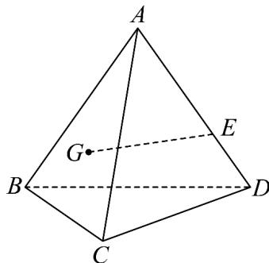

<!-- question-source:start -->
【变式2】如图，四面体ABCD中，点G是VABC的重心，点E在AD上，AE=2ED·

(1)求证：GE // 平面 BCD；

(2)设过点 G, E, C 的平面为 $\alpha$ , $\alpha$ 与四面体的面相交，交线围成一个多边形.

(i) 请在图中画出这个多边形（不必说出画法和理由）；

(ii) 求出 $\alpha$ 将四面体分成两部分几何体体积之比.
<!-- question-source:end -->

![[高中/课堂同步/题库/人教A版高中数学同步讲义(2026)/02_必修第二册/第八章 立体几何初步/专题8.5 空间直线、平面的平行（高效培优讲义）/题型03_直线与平面平行的判定/questions/answers/Q00069832A1.md]]
