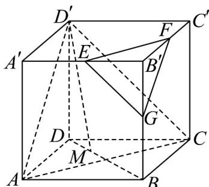

<!-- question-source:start -->
【变式3】如图所示，在这个正方体中，棱长为 $2$ ， $E$ 、 $F$ 分别为所在棱的中点，点 $G$ 在棱 $BB^{\prime}$ 上，且满足 $B^{\prime}G = aB^{\prime}B$

(1)若 $a = 0.5$ ，求证： $EG / /$ 平面 $D^{\prime}AC$

(2)若点 $M$ 在线段 $BD$ 上，且满足 $D^{\prime}M / /$ 平面 $EFG$ ，且 $a$ 的取值范围为 $\left[\frac{1}{2},1\right]$ ，求 $D^{\prime}M$ 的取值范围
<!-- question-source:end -->

![[高中/课堂同步/题库/人教A版高中数学同步讲义(2026)/02_必修第二册/第八章 立体几何初步/专题8.5 空间直线、平面的平行（高效培优讲义）/题型03_直线与平面平行的判定/questions/answers/Q00069833A1.md]]
