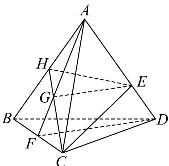

> [!faq]- 《专题8.5 空间直线、平面的平行（高效培优讲义）》官方解析
>
> > [!success]- **【答案】** (1)证明见解析 (2)(i) 答案见解析；(ii) $\frac{1}{2}$
>
> > [!note]- **【分析】**
> > （1）连接 AG 并延长交 BC 于点 F，连接 DF，由比例关系得 $GE \parallel DF$ ，即可证明；
> >
> > (2) (i) 连接 $CG$ 并延长交 $AB$ 于点 $H$ , 连接 $HE$ , $EC$ , 则平面 $HEC$ 即为 $\alpha$ .
> >
> > （ii）由（i）知， $\alpha$ 将四面体 $ABCD$ 分成两部分，由 $\triangle AHE$ 的面积与四边形 $BDEH$ 的面积之比为 $1:2$ 进行求解
>
> > [!note]- **【解析】**
> > （1）连接 AG 并延长交 BC 于点 F，连接 DF
> >
> > 
> >
> > 因为 $\frac{AG}{GF} = \frac{AE}{ED} = 2$ ，所以 GE //DF，
> >
> > $GE \subset$ 平面 BCD， $DF \subset$ 平面 BCD，所以 GE // 平面 BCD
> >
> > (2) (i) 连接 CG 并延长交 AB 于点 H，连接 HE，EC，则平面 HEC 即为 $\alpha$ .
> >
> > (ii) 由 (i) 知， $\alpha$ 将四面体 $ABCD$ 分成两部分，
> >
> > 分别为三棱锥 C-AHE 与四棱锥 C-BDEH，很显然两个棱锥的高相等，记为 h，
> >
> > 的面积与 $\triangle AHE$ 的面积之比为 $\frac{\frac{1}{2}\times|AH|\times|AE|\times\sin\angle HAE}{\frac{1}{2}\times|AB|\times|AD|\times\sin\angle HAE}=\frac{1}{3}$
> >
> > 所以 $\triangle AHE$ 的面积与四边形 BDEH 的面积之比为 1:2，
> >
> > 则 $\frac{V_{C - AHE}}{V_{C - BDEH}} = \frac{\frac{1}{3}h\times S_{\triangle AHE}}{\frac{1}{3}h\times S_{BDEH}} = \frac{1}{2}$
