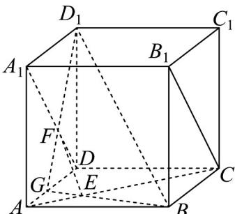

<!-- question-source:start -->
【变式1】已知正方体 $ABCD - A_{1}B_{1}C_{1}D_{1}$ ， $E$ 、 $F$ 分别为 $AC$ 和 $A_{1}D$ 上的点，且 $EF\perp AC$ ， $EF\perp B_{1}C$

(1)求证： $EF//BD_{1}$ ;

(2)设 $BE \cap D_{1}F = G$ ，求证： $G$ ， $A$ ， $D$ 三点共线·
<!-- question-source:end -->

![[高中/课堂同步/题库/人教A版高中数学同步讲义(2026)/02_必修第二册/第八章 立体几何初步/专题8.5 空间直线、平面的平行（高效培优讲义）/题型04_直线与平面平行的性质/questions/answers/Q00069834A1.md]]
