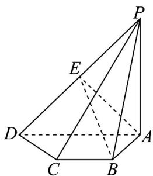

<!-- question-source:start -->
【变式2】如图，在四棱锥 $P - ABCD$ 中， $BC \parallel AD$ ， $AD = 2BC$ ，点 $E$ 是棱 $PD$ 的中点， $PC$ 与平面 $ABE$ 交于 $F$ 点，设 $CP = \lambda CF$ ，则 $\lambda = (\quad)$

A. 3 B. 2 C. $\frac{1}{3}$ D. $\frac{1}{2}$
<!-- question-source:end -->

![[高中/课堂同步/题库/人教A版高中数学同步讲义(2026)/02_必修第二册/第八章 立体几何初步/专题8.5 空间直线、平面的平行（高效培优讲义）/题型04_直线与平面平行的性质/questions/answers/Q00069835A1.md]]
