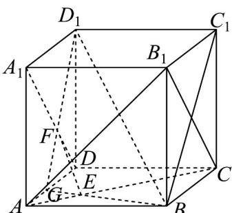

> [!faq]- 《专题8.5 空间直线、平面的平行（高效培优讲义）》官方解析
>
> > [!success]- **【答案】** (1)证明过程见解析 (2)证明过程见解析
>
> > [!note]- **【分析】**
> > （ $^{1}$ ）根据线面垂直的判定定理，结合正方体的性质、线面垂直的性质进行证明即可；
> >
> > (2) 根据面面相交的性质，结合 (1) 的结论证明即可.
>
> > [!note]- **【解析】**
> > （1）如图，连结 $AB_{1}$ ，在正方体 $ABCD - A_{1}B_{1}C_{1}D_{1}$ 中，
> >
> > $\therefore EF \perp B_{1}C$ 又 $EF \perp AC$ $AC \cap B_{1}C = C$
> >
> > $\therefore EF \perp$ 平面 $AB_{1}C$
> >
> > 又在正方体 $ABCD - A_{1}B_{1}C_{1}D_{1}$ 中，连接 $BC_{1}$ ，
> >
> > $B_{1}C\perp BC_{1}$ $B_{1}C\perp D_{1}C_{1},BC_{1}\cap D_{1}C_{1} = C_{1}$
> >
> > $\therefore B_{1}C \perp$ 平面 $BC_{1}D_{1}$
> >
> > 又 $BD_{1} \subset$ 平面 $BC_{1}D_{1}$ ，∴ $B_{1}C \perp BD_{1}$
> >
> > 同理可得 $B_{1}A \perp BD_{1}$ .
> >
> > 又 $B_{1}A \cap B_{1}C = B_{1}$ ，∴ $BD_{1} \perp$ 平面 $AB_{1}C$
> >
> > $EF//BD_{1};$
> >
> > (2) 由题意可得 $EF < BD_{1}$ ，又由 (1) 知 $EF // BD_{1}$
> >
> > 所以直线 $D_{1}F$ 和 $BE$ 必相交，不妨设 $BE \cap D_{1}F = G$
> >
> > 则 $G\in D_1F$
> >
> > 又 $D_{1}F\subset$ 平面 $AA_{1}D_{1}D$
> >
> > 所以 $G \in$ 平面 $AA_{1}D_{1}D$
> >
> > 同理 $G \in$ 平面ABCD.
> >
> > 因为平面 $AA_{1}D_{1}D \cap$ 平面 ABCD = AD ，
> >
> > 所以 $G \in AD$
> >
> > 所以 BE 、 $D_{1}F$ 、 DA 三条直线交于一点．
> >
> > 
