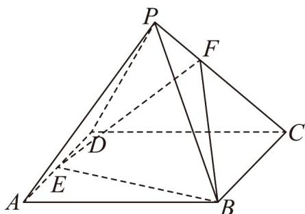

<!-- question-source:start -->
【变式2】如图，在四棱锥 $P - ABCD$ 中，底面ABCD为平行四边形， $E,F$ 分别为棱 $AD,PC$ 上的点，若

$AE:ED = 2:3$ ，且 $PA / /$ 平面 $EBF$ ，则 $\frac{PF}{FC} =$

<!-- question-source:end -->

![[高中/课堂同步/题库/人教A版高中数学同步讲义(2026)/02_必修第二册/第八章 立体几何初步/专题8.5 空间直线、平面的平行（高效培优讲义）/题型05_由线面平行的性质判断比例关系或点的位置关系/questions/answers/Q00069838A1.md]]
