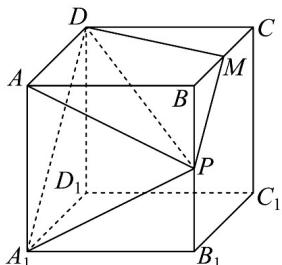

> [!faq]- 《专题8.5 空间直线、平面的平行（高效培优讲义）》官方解析
>
> > [!success]- **【答案】** ACD
>
> > [!note]- **【分析】**
> > A·根据平面的性质，作出截面，即可判断 A，根据线面平行的性质定理，结合 A 的判断，判断 B，根
> >
> > 据勾股定理求点 $Q$ 的轨迹，判断 $\mathbb{C}$ ，首先求 $\triangle AA_{1}P$ 外接圆的半径，并根据 $DA \perp$ 平面 $APA_{1}$ ，求三棱锥外接球的
> >
> > 半径，即可判断 D.
>
> > [!note]- **【解析】**
> > 取 $BC$ 的中点 $M$ ，连结 $MP,MD$ ，因为 $MP / / A_{1}D$ ，所以平面 $A_{1}PD$ 截正方体所得截面为四边形 $A_{1}PMD$
> >
> > $A_{1}P = DM = \sqrt{1 + \frac{1}{4}} = \frac{\sqrt{5}}{2}$ ，所以四边形 $A_{1}PMD$ 是等腰梯形，故 $\mathsf{A}$ 正确；
> >
> > 
> >
> > B. 因为 $C_{1}Q //$ 平面 $A_{1}PD$ ，且 $C_{1}Q \subset$ 平面 $BB_{1}C_{1}C$ ，且平面 $BB_{1}C_{1}C \cap$ 平面 $A_{1}PD = PM$
> >
> > 所以 $C_{1}Q // PM$ ，则点 Q 在 $B_{1}C$ 上，当点 Q 在 $B_{1}C$ 的中点时，此时 $CQ \perp C_{1}Q$ ，故 B 错误；
> >
> > C. 因为 $DC \perp CQ$ ， $CQ = \sqrt{DQ^2 - DC^2} = \sqrt{\frac{6}{4} - 1} = \frac{\sqrt{2}}{2}$ ，所以点 $Q$ 的轨迹是以点 $C$ 为圆心，半径为 $\frac{\sqrt{2}}{2}$ 的圆的 $\frac{1}{4}$
> >
> > 所以轨迹长为 $\frac{1}{4} \times 2\pi \times \frac{\sqrt{2}}{2} = \frac{\sqrt{2}}{4}\pi$ ，故 $C$ 正确；
> >
> > D. 三棱锥 $A-A_{1}PD$ 和三棱锥 $D-APA_{1}$ 是同一个棱锥，
> >
> > 中， $\cos \angle APA_{1} = \frac{\frac{5}{4} + \frac{5}{4} - 1}{2 \times \frac{\sqrt{5}}{2} \times \frac{\sqrt{5}}{2}} = \frac{3}{5}$ ，则 $\sin \angle APA_{1} = \frac{4}{5}$ ，则 $\triangle AA_{1}P$ 外接圆的半径 $r = \frac{AA_{1}}{2 \sin \angle APA_{1}} = \frac{5}{8}$ ，
> >
> > 因为 $DA \perp$ 平面 $APA_{1}$ ，所以三棱锥 $D - APA_{1}$ 的外接球的半径 $R = \sqrt{r^{2} + \left(\frac{DA}{2}\right)^{2}} = \sqrt{\frac{25}{64} + \frac{1}{4}} = \frac{\sqrt{41}}{8}$ ，故 D 正确·
> >
> > 故选 **ACD**
