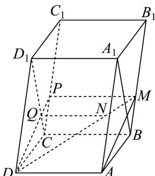

## 题型05 由线面平行的性质判断比例关系或点的位置关系

【典例1】在平行六面体 $ABCD - A_{1}B_{1}C_{1}D_{1}$ 中，点 $M$ 是 $BB_{1}$ 上靠近 $B$ 的三等分点，直线 $DM$ 交平面 $BCD_{1}A_{1}$ 于点 $N$ ，则 $\frac{DN}{DM} = (\quad)$ A. $\frac{1}{2}$ B. $\frac{2}{3}$ C. $\frac{3}{4}$ D. $\frac{4}{5}$

【答案】C

【分析】作图，根据线面平行的判定定理可知 $PM / /$ 平面 $CBA_{1}D_{1}$ ，然后根据线面平行的性质定理可知

$PM\parallel QN$ ，可得 $\frac{DN}{MN}=\frac{DQ}{PQ}=\frac{DD_{1}}{CP}=\frac{CC_{1}}{CP}$ ，判断即可·

【详解】设平面 DAM 与 $CC_{1}$ 交于点 P，连接 DP 交 $D_{1}C$ 于点 Q，连接 QN，如图：

因为 $CB \parallel DA, CB \not\subset$ 平面 DAM， $DA \subset$ 平面 DAM，

所以 CB // 平面 DAM，又 $CB \subset$ 平面 $CBB_{1}C_{1}$ ，平面 $DAM \cap$ 平面 $CBB_{1}C_{1} = PM$ ，所以 $CB \parallel PM$ ，

因为 M 是三等分点，所以 $\frac{CC_{1}}{CP}=3$ ，因为 $CB\subset$ 平面 $CBA_{1}D_{1}, PM\not\subset$ 平面 $CBA_{1}D_{1}$ ，所以 $PM//$ 平面 $CBA_{1}D_{1}$ ，又 $PM\subset$ 平面 PDM，平面 $CBA_{1}D_{1}\cap$ 平面 PDM=QN，所以 $PM\parallel QN$ ，

所以 $\frac{DN}{MN} = \frac{DQ}{PQ} = \frac{DD_1}{CP} = \frac{CC_1}{CP} = 3$ ，因此 $\frac{DN}{DM} = \frac{3}{4}$ .故选：C

![[高中/课堂同步/题库/人教A版高中数学同步讲义(2026)/02_必修第二册/第八章 立体几何初步/专题8.5 空间直线、平面的平行（高效培优讲义）/题型05_由线面平行的性质判断比例关系或点的位置关系/questions/Q00069837.md]]
![[高中/课堂同步/题库/人教A版高中数学同步讲义(2026)/02_必修第二册/第八章 立体几何初步/专题8.5 空间直线、平面的平行（高效培优讲义）/题型05_由线面平行的性质判断比例关系或点的位置关系/questions/Q00069838.md]]
![[高中/课堂同步/题库/人教A版高中数学同步讲义(2026)/02_必修第二册/第八章 立体几何初步/专题8.5 空间直线、平面的平行（高效培优讲义）/题型05_由线面平行的性质判断比例关系或点的位置关系/questions/Q00069839.md]]
