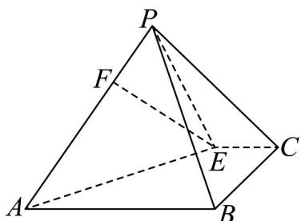

<!-- question-source:start -->
【变式3】如图，在四棱锥 $P - ABCE$ 中，四边形 $ABCE$ 是梯形， $AB // CE$ ，且 $AB = 3CE$ ，点 $F$ 在棱 $PA$ 上，且

$EF \parallel$ 平面 $PBC$ ，则 $\frac{PF}{FA} = (\quad)$

A. $\frac{1}{3}$ B. $\frac{1}{2}$ C. $\frac{2}{3}$ D. $\frac{3}{4}$
<!-- question-source:end -->

![[高中/课堂同步/题库/人教A版高中数学同步讲义(2026)/02_必修第二册/第八章 立体几何初步/专题8.5 空间直线、平面的平行（高效培优讲义）/题型06_由线面平行的性质求长度问题/questions/answers/Q00069842A1.md]]
