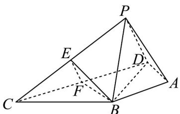

<!-- question-source:start -->
【变式2】如图，在四棱锥 $P - ABCD$ 中， $\triangle BCD$ 为等边三角形， $BD = 2\sqrt{3}$ ， $PA = \sqrt{3}$ ， $AB = AD = PB = PD$

$\angle BAD=120^{\circ}$ ，点E，F分别为PC，CD的中点·(1)求证：平面 $BEF //$ 平面 PAD；

(2)求二面角 P-BD-A 的余弦值.
<!-- question-source:end -->

![[高中/课堂同步/题库/人教A版高中数学同步讲义(2026)/02_必修第二册/第八章 立体几何初步/专题8.5 空间直线、平面的平行（高效培优讲义）/题型07_平面与平面平行的判定/questions/answers/Q00069844A1.md]]
