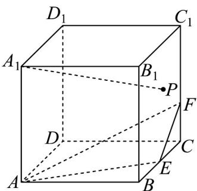

<!-- question-source:start -->
【变式3】已知正四棱柱 $ABCD - A_{1}B_{1}C_{1}D_{1}$ 的侧棱长为 $^{3}$ ，底面边长为 $^{2}$ ， $E$ 是棱 $BC$ 的中点， $F$ 是棱 $CC_{1}$ 上靠

近点 $C$ 的三等分点，动点 $P$ 在侧面 $BCC_{1}B_{1}$ （包括边界）内运动，若 $PA_{1} / /$ 平面 $AEF$ 则线段 $PA_{1}$ 长度的最小值

是（）

A. $\sqrt{5}$ B. 3 C. $\frac{3\sqrt{2}}{2}$ D. $2\sqrt{3}$
<!-- question-source:end -->

![[高中/课堂同步/题库/人教A版高中数学同步讲义(2026)/02_必修第二册/第八章 立体几何初步/专题8.5 空间直线、平面的平行（高效培优讲义）/题型07_平面与平面平行的判定/questions/answers/Q00069845A1.md]]
