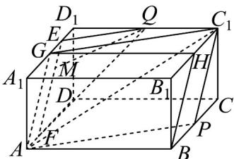

> [!faq]- 《专题8.5 空间直线、平面的平行（高效培优讲义）》官方解析
>
> > [!success]- **【答案】** C
>
> > [!note]- **【分析】**
> > 根据给定条件，过点 $Q$ 作出与平面 $APC_{1}$ 平行的长方体部分截面，确定点 $M$ 的轨迹即可·
>
> > [!note]- **【解析】**
> > 在长方体 $ABCD-A_{1}B_{1}C_{1}D_{1}$ 中，取 $A_{1}D_{1}, B_{1}C_{1}$ 的中点 G, H ，连接 AG, GH, BH ，
> >
> > 
> >
> > 由点 $P$ 为 $BC$ 的中点，得 $C_1H // BP, C_1H = BP$ ，则四边形 $BPC_1H$ 是平行四边形，
> >
> > $BH //C_{1}P$ ，又 $GH //A_{1}B_{1} //AB, GH = A_{1}B_{1} = AB$ ，则四边形 ABHG 是平行四边形，
> >
> > 于是 $AG / / BH / / C_1P$ ，取 $GD_{1}$ 中点 $E$ ，在 $AD$ 上取点 $F$ ，使得 $AF = GE$ ，连接 $EF, QE, QF$
> >
> > 而 $AF // GE$ ，则四边形 $AGEF$ 为平行四边形， $EF // AG$ ，而 $AG \subset$ 平面 $APC_1$ ， $EF \not\subset$ 平面 $APC_1$
> >
> > 于是 $EF / /$ 平面 $APC_{1}$ ，由 $Q$ 为 $C_1D_1$ 的中点，得 $QE / / C_1G$ ，而 $C_1G \subset$ 平面 $APC_{1}$ ， $QE \notin$ 平面 $APC_{1}$
> >
> > 则 $QE / /$ 平面 $APC_{1}$ ，又 $EF\cap QE = E,EF,QE\subset$ 平面 $QEF$ ，因此平面 $QEF / /$ 平面 $APC_{1}$
> >
> > 由直线 $QM / /$ 平面 $APC_{1}$ ，点 $M\in$ 平面 $ADD_{1}A_{1}$ ，则点 $M$ 在平面 $QEF$ 与平面 $ADD_{1}A_{1}$ 的交线上，
> >
> > 从而点 $M$ 的轨迹是线段 $EF$ ，而 $EF = AG = \sqrt{A_1G^2 + A_1A^2} = 2\sqrt{2}$
> >
> > 所以点 $M$ 的轨迹长度为 $2 \sqrt{2}$ .
> >
> > 故选 **C**
