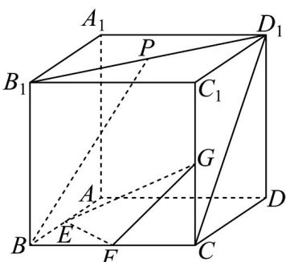
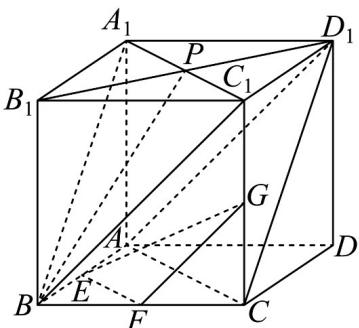
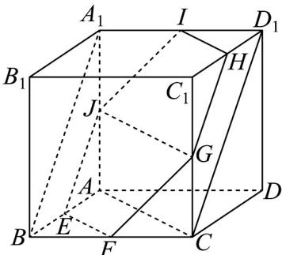

## 题型07 平面与平面平行的判定

【典例1】如图，在棱长为 $^{2}$ 的正方体 $ABCD-A_{1}B_{1}C_{1}D_{1}$ 中，E，F，G分别是AB，BC， $CC_{1}$ 的中点，点P在

线段 $B_{1}D_{1}$ 上， $BP//$ 平面EFG，则以下正确的是（）

A. $D_{1}C$ 与 $EF$ 所成角为 $60^{\circ}$ B.点 $P$ 为线段 $B_{1}D_{1}$ 的中点C.三棱锥 $P - EFG$ 的体积为 $\frac{1}{2}$ D.平面 $EFG$ 截正方体所得截面的面积为 $3\sqrt{3}$

【答案】ABD

【分析】对于 $^{A}$ ，连接 $AC, AD_{1}$ ，得出 $\angle ACD_{1}$ 即为 $D_{1}C$ 与EF所成角的平面角即可判断；对于 $^{B}$ ，连接 $A_{1}C_{1}, A_{1}B, BC_{1}$ ，证明平面 $PBC_{1}$ 和平面 $A_{1}BC_{1}$ 重合即可判断；对于 $^{C}$ ，利用等体积法求出三棱锥P-EFG的体积；对于 $^{D}$ ：先判断出平面 EFG 截正方体所得截面为正六边形 EFGHIJ，边长为 $\sqrt{2}$ ，即可判断

【详解】对于 A，连接 $AC, AD_{1}$

因为 E, F 分别为 AB, BC 的中点，所以 $EF \parallel AC$ ，

所以 $\angle ACD_{1}$ 即为 $D_{1}C$ 与 EF 所成角的平面角，

在 $\triangle ACD_{1}$ 中， $AC = CD_{1} = AD_{1}$ ，故 $\angle ACD_{1} = 60^{\circ}$

所以 $D_{1}C$ 与 EF 所成角为 $60^{\circ}$ ，故 A 正确；

对于 B，连接 $A_{1}C_{1}, A_{1}B, BC_{1}$

因为 $AA_{1} / / CC_{1}$ 且 $AA_{1} = CC_{1}$

所以四边形 $ACC_{1}A_{1}$ 为平行四边形，所以 $AC//A_{1}C_{1}$

又因为 $EF \parallel AC$ ，所以 $EF \parallel A_{1}C_{1}$

又 $EF \subset$ 平面 $EFG$ ， $A_{1}C_{1} \notin$ 平面 $EFG$

所以 $A_{1}C_{1}//$ 平面 EFG ，

因为 $F, G$ 分别为 $BC, CC_{1}$ 的中点，所以 $FG // BC_{1}$

又 $FG \subset$ 平面 EFG ， $BC_{1} \not\subset$ 平面 EFG ，

所以 $BC_{1}$ 平面 EFG ，

又 $A_{1}C_{1}\cap BC_{1} = C_{1},A_{1}C_{1},BC_{1}\subset$ 平面 $A_{1}BC_{1}$

所以平面 $A_{1}BC_{1} //$ 平面 $EFG$ ，

因为 $BP \parallel$ 平面 $EFG$ ， $BP \cap BC_{1} = C_{1}, BP, BC_{1} \subset$ 平面 $PBC_{1}$

所以平面 $PBC_{1}$ // 平面 EFG ，

而 $BC_{1}$ 为平面 $PBC_{1}$ 和平面 $A_{1}BC_{1}$ 的公共边，

所以平面 $PBC_{1}$ 和平面 $A_{1}BC_{1}$ 重合，

所以点 P 即为 $A_{1}C_{1}, B_{1}D_{1}$ 的交点，

所以点 P 为线段 $B_{1}D_{1}$ 的中点，故 B 正确；

对于 C：因为 BP// 平面 EFG，所以点 B, P 到平面 EFG 的距离相等，

$V_{P-EFG}=V_{B-EFG}=V_{G-BEF}=\frac{1}{3}S_{\triangle BEF}\times CG=\frac{1}{3}\times\frac{1}{2}\times1\times1\times1=\frac{1}{6}$ ，故C错误；

对于 D：分别取 $C_{1}D_{1}$ ， $A_{1}D_{1}$ ， $AA_{1}$ 的中点为 H, I, J，连接 GH, HI, IJ, JE, JG, $A_{1}B$

在正方体 $ABCD - A_{1}B_{1}C_{1}D_{1}$ 中， $AC // JG, AC // EF$

所以 $JG//EF$ ，所以 $E,F,G,J$ 四点共面，

同理可证：E,F,G,J,H,I 共面，

在棱长为 $^{2}$ 的正方体 $ABCD-A_{1}B_{1}C_{1}D_{1}$ 中，所以 $EF=\sqrt{1^{2}+1^{2}}=\sqrt{2}$

同理可求： $FG = GH = HI = IJ = JE = \sqrt{2}$

所以平面 $EFG$ 截正方体所得截面为正六边形 $EFGHIJ$ ，边长为 $\sqrt{2}$

面积为 $6 \times \frac{1}{2} \times \sqrt{2} \times \sqrt{2} \times \sin 60^{\circ} = 3\sqrt{3}$ ，故 D 正确.

故选：ABD

![[高中/课堂同步/题库/人教A版高中数学同步讲义(2026)/02_必修第二册/第八章 立体几何初步/专题8.5 空间直线、平面的平行（高效培优讲义）/题型07_平面与平面平行的判定/questions/Q00069843.md]]
![[高中/课堂同步/题库/人教A版高中数学同步讲义(2026)/02_必修第二册/第八章 立体几何初步/专题8.5 空间直线、平面的平行（高效培优讲义）/题型07_平面与平面平行的判定/questions/Q00069844.md]]
![[高中/课堂同步/题库/人教A版高中数学同步讲义(2026)/02_必修第二册/第八章 立体几何初步/专题8.5 空间直线、平面的平行（高效培优讲义）/题型07_平面与平面平行的判定/questions/Q00069845.md]]
