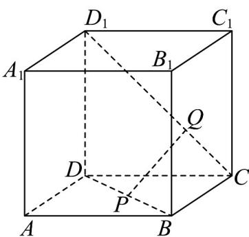

<!-- question-source:start -->
【变式1】如图，已知在正方体 $ABCD - A_{1}B_{1}C_{1}D_{1}$ 中， $P$ ， $Q$ 分别为对角线 $BD$ ， $CD_{1}$ 上的点，

$\frac{CQ}{QD_1} = \frac{BP}{PD} = \lambda (0 < \lambda < 1)$ .

(1)求证： $PQ \parallel$ 平面 $BCC_{1}B_{1}$ .

$$
\frac {A R}{A B}
$$

(2)若 R 是 AB 上的点，当 $\overline{AB}$ 的值为多少时（用 $\lambda$ 表示），能使平面 $PQR \parallel$ 平面 $A_{1}D_{1}DA$ ? 请给出证明.
<!-- question-source:end -->

![[高中/课堂同步/题库/人教A版高中数学同步讲义(2026)/02_必修第二册/第八章 立体几何初步/专题8.5 空间直线、平面的平行（高效培优讲义）/题型08_补全平面与平面平行的条件/questions/answers/Q00069846A1.md]]
